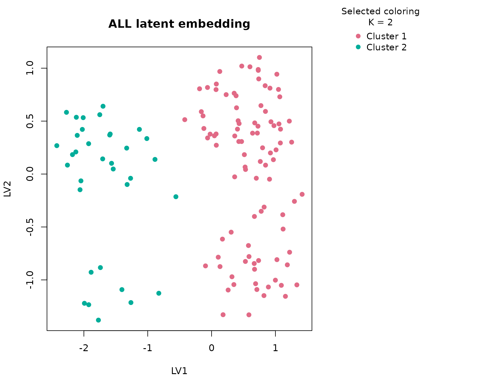

# ALL

## Background

`ALL` is a classic Bioconductor microarray experiment package for acute
lymphoblastic leukemia. The raw experiment contains expression
measurements for 128 patients together with immunophenotype and
molecular subtype annotations. `uccdf` ships a compact derivative called
`all_gene_panel` that preserves a small set of highly variable probe
sets together with the observed lineage and clinical context needed for
interpretation.

This is a useful omics example because the dominant biological axis is
not subtle. B-lineage and T-lineage samples differ strongly, and some
molecular subtypes sit on top of that broader split. A tutorial article
should therefore do more than state that clusters exist. It should show
which expression features carry the separation, how strongly the
consensus supports the split, and how the resulting groups line up with
established leukemia annotations.

## Objective

The objective is to determine whether the reduced `ALL` panel supports a
stable consensus partition and whether the selected clusters correspond
to the major B-cell versus T-cell immunophenotype distinction. A
secondary objective is to check whether molecular subtype information
remains unevenly distributed across the recovered clusters, which would
suggest that the compact panel still contains clinically interpretable
structure.

## Data preparation

``` r
if (file.exists("data/all_gene_panel.rda")) {
  load("data/all_gene_panel.rda")
} else if (file.exists("../data/all_gene_panel.rda")) {
  load("../data/all_gene_panel.rda")
} else {
  data(all_gene_panel, package = "uccdf")
}
analysis_all <- all_gene_panel[, c(
  "sample_id", "38355_at", "36638_at", "38514_at", "41214_at",
  "36108_at", "39318_at", "38096_f_at", "38319_at"
)]
head(analysis_all)
#>       sample_id 38355_at  36638_at  38514_at 41214_at  36108_at  39318_at
#> 01005     01005 9.208196  7.694118  8.783013 9.890862  4.472759  9.559630
#> 01010     01010 8.602583  7.090124 11.040864 9.135392 10.014685 10.869600
#> 03002     03002 3.409324  6.087817  9.321789 5.277870  8.815481  5.980342
#> 04006     04006 7.631437 10.918375  4.416378 9.522582  7.278217  7.168756
#> 04007     04007 9.460676 10.068065  7.746814 9.813016  8.771589 10.304546
#> 04008     04008 8.187486  3.297679  7.583775 9.856136  8.829652  6.964849
#>       38096_f_at 38319_at
#> 01005   11.20942 4.194986
#> 01010   10.78209 6.215835
#> 03002   10.53502 4.470794
#> 04006    9.66569 4.751396
#> 04007   10.71009 4.430895
#> 04008   11.39216 4.919729
```

``` r
table(all_gene_panel$bt, useNA = "ifany")
#> 
#>  B B1 B2 B3 B4  T T1 T2 T3 T4 
#>  5 19 36 23 12  5  1 15 10  2
table(all_gene_panel$sex, useNA = "ifany")
#> 
#>    F    M <NA> 
#>   42   83    3
summary(all_gene_panel$age)
#>    Min. 1st Qu.  Median    Mean 3rd Qu.    Max.    NA's 
#>    5.00   19.00   29.00   32.37   45.50   58.00       5
```

## Analysis

``` r
fit_all <- fit_uccdf(
  analysis_all,
  id_column = "sample_id",
  candidate_k = 1:5,
  n_resamples = 20,
  n_null = 39,
  row_fraction = 0.9,
  col_fraction = 0.9,
  seed = 101
)

fit_all$selection
#> $alpha
#> [1] 0.05
#> 
#> $global_p_value
#> [1] 0.025
#> 
#> $null_family
#> [1] "independence_marginal_null"
#> 
#> $detected_structure
#> [1] TRUE
#> 
#> $best_exploratory_k
#> [1] 2
#> 
#> $best_supported_k
#> [1] 2
select_k(fit_all)
#>   k stability null_mean    null_sd stability_excess   z_score p_value supported
#> 1 2 0.9038448 0.2721660 0.03754539        0.6316788 16.824401   0.025      TRUE
#> 2 3 0.9552416 0.2962040 0.05046363        0.6590376 13.059654   0.025      TRUE
#> 3 4 0.8158979 0.3600883 0.05469783        0.4558096  8.333229   0.025      TRUE
#> 4 5 0.7651567 0.4323472 0.04910173        0.3328095  6.777959   0.025      TRUE
#>   objective
#> 1 16.685771
#> 2 12.839931
#> 3  7.055970
#> 4  5.456071
```

## Results

``` r
all_assign <- merge(
  augment(fit_all),
  all_gene_panel,
  by.x = "row_id",
  by.y = "sample_id",
  all.x = TRUE
)

head(all_assign)
#>   row_id cluster confidence  ambiguity exploratory_cluster
#> 1  01003       2  0.9800777 0.01992226                   2
#> 2  01005       1  0.9878672 0.01213278                   1
#> 3  01007       2  0.9700602 0.02993975                   2
#> 4  01010       1  0.9879423 0.01205769                   1
#> 5  02020       2  0.9704433 0.02955670                   2
#> 6  03002       1  0.9851101 0.01488992                   1
#>   exploratory_confidence exploratory_ambiguity assignment_mode selected_k
#> 1              0.9800777            0.01992226        selected          2
#> 2              0.9878672            0.01213278        selected          2
#> 3              0.9700602            0.02993975        selected          2
#> 4              0.9879423            0.01205769        selected          2
#> 5              0.9704433            0.02955670        selected          2
#> 6              0.9851101            0.01488992        selected          2
#>   exploratory_k 38355_at 36638_at  38514_at 41214_at  36108_at  39318_at
#> 1             2 9.343481 3.937520  4.142900 9.543518  4.274392  5.652315
#> 2             2 9.208196 7.694118  8.783013 9.890862  4.472759  9.559630
#> 3             2 3.284177 4.023000  8.436490 4.842859  4.645137  5.538086
#> 4             2 8.602583 7.090124 11.040864 9.135392 10.014685 10.869600
#> 5             2 3.333845 3.800702  8.043980 4.845538  5.381358  6.093337
#> 6             2 3.409324 6.087817  9.321789 5.277870  8.815481  5.980342
#>   38096_f_at  38319_at bt mol_biol sex age age_band
#> 1   5.974618 10.016641  T      NEG   M  31    21-40
#> 2  11.209422  4.194986 B2  BCR/ABL   M  53    41-60
#> 3   4.159461  8.754029 T3   NUP-98   F  16     <=20
#> 4  10.782087  6.215835 B2      NEG   M  19     <=20
#> 5   6.574654  9.450256 T2      NEG   F  48    41-60
#> 6  10.535016  4.470794 B4  BCR/ABL   F  52    41-60
```

The selected solution should be read together with the assignment table.
The key practical outputs are the selected cluster, the confidence
value, and the original annotation columns used only for interpretation.

``` r
aggregate(
  cbind(`38355_at`, `36638_at`, `38514_at`, `41214_at`,
        `36108_at`, `39318_at`, `38096_f_at`, `38319_at`, confidence) ~ cluster,
  all_assign,
  function(x) round(mean(x, na.rm = TRUE), 2)
)
#>   cluster 38355_at 36638_at 38514_at 41214_at 36108_at 39318_at 38096_f_at
#> 1       1     6.79     7.34     7.93     7.92     7.38     9.22      10.31
#> 2       2     7.44     3.86     6.97     8.30     5.02     6.02       6.02
#>   38319_at confidence
#> 1     4.84       0.98
#> 2     9.37       0.96
```

``` r
table(all_assign$cluster, all_assign$bt)
#>    
#>      B B1 B2 B3 B4  T T1 T2 T3 T4
#>   1  5 19 36 23 11  0  0  0  0  0
#>   2  0  0  0  0  1  5  1 15 10  2
round(prop.table(table(all_assign$cluster, all_assign$bt), margin = 1), 3)
#>    
#>         B    B1    B2    B3    B4     T    T1    T2    T3    T4
#>   1 0.053 0.202 0.383 0.245 0.117 0.000 0.000 0.000 0.000 0.000
#>   2 0.000 0.000 0.000 0.000 0.029 0.147 0.029 0.441 0.294 0.059
```

``` r
sort(table(all_assign$mol_biol), decreasing = TRUE)[1:10]
#> 
#>      NEG  BCR/ABL ALL1/AF4 E2A/PBX1   NUP-98  p15/p16     <NA>     <NA> 
#>       74       37       10        5        1        1                   
#>     <NA>     <NA> 
#> 
round(prop.table(table(all_assign$cluster, all_assign$mol_biol), margin = 1), 3)
#>    
#>     ALL1/AF4 BCR/ABL E2A/PBX1   NEG NUP-98 p15/p16
#>   1    0.106   0.394    0.043 0.447  0.000   0.011
#>   2    0.000   0.000    0.029 0.941  0.029   0.000
```

``` r
plot_embedding(fit_all, color_by = "selected", main = "ALL latent embedding")
```



``` r
plot_consensus_heatmap(fit_all, main = "ALL consensus heatmap")
```


## Discussion

This dataset behaves the way a strong omics example should. The global
null is rejected, the selected solution remains supported after null
calibration, and the consensus heatmap shows a broad block structure
rather than a fragile, sample-by-sample patchwork. In practice, the
selected two-cluster solution aligns closely with the major B-lineage
versus T-lineage separation. That is important because it shows the
compact panel still carries the dominant biology even after the original
expression matrix has been reduced to a small sample table.

The subtype table adds a second layer of interpretation. Several
molecular subtypes concentrate within one lineage-defined cluster rather
than being distributed uniformly across both groups. That is exactly the
pattern we would expect if the first consensus split captures a broad
developmental axis and the remaining within-lineage heterogeneity is
real but secondary. In other words, the compact panel is not merely
separating noise; it is preserving an interpretable hierarchy of disease
structure.

The article also highlights a design point of `uccdf`. The package is
not trying to replace a full leukemia workflow based on the original
high-dimensional matrix. Instead, it shows how one can carry a
biologically grounded sample-level table into a typed consensus analysis
while keeping the output defensible with a null-calibrated `K` decision.

## Interpretation

For `ALL`, the selected clusters should be interpreted as stable
expression-defined patient groups that primarily reflect the B-cell
versus T-cell immunophenotype split. The agreement with `bt` is strong
enough that the clusters are easy to explain, while the molecular
subtype table reminds us that each cluster still contains clinically
meaningful internal heterogeneity. In a real project, this would justify
drilling into subtype-enriched clusters rather than stopping at the
first partition.
