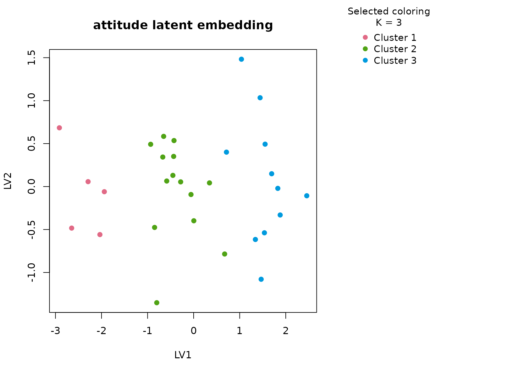

# attitude

## Background

`attitude` contains ratings of managerial behavior and workplace
climate. It is not a biomedical dataset, but it is valuable because it
represents the kind of small organizational table where analysts are
tempted to over-cluster weak structure. Most variables are numeric
ratings, and we add one ordinal summary band to preserve the mixed-table
framing.

## Objective

The objective is to determine whether the ratings support stable
workplace climate groupings and, if they do, whether those groups can be
interpreted in terms of complaints, learning opportunities, raises, and
overall rating level.

## Data preparation

``` r
att_df <- as.data.frame(attitude)
att_df$sample_id <- sprintf("AT%03d", seq_len(nrow(att_df)))
att_df$rating_band <- ordered(
  cut(att_df$rating, breaks = c(-Inf, 55, 70, Inf), labels = c("low", "mid", "high")),
  levels = c("low", "mid", "high")
)

analysis_att <- att_df[, c("sample_id", "rating", "complaints", "privileges", "learning", "raises", "rating_band")]
head(analysis_att)
#>   sample_id rating complaints privileges learning raises rating_band
#> 1     AT001     43         51         30       39     61         low
#> 2     AT002     63         64         51       54     63         mid
#> 3     AT003     71         70         68       69     76        high
#> 4     AT004     61         63         45       47     54         mid
#> 5     AT005     81         78         56       66     71        high
#> 6     AT006     43         55         49       44     54         low
```

## Analysis

``` r
fit_att <- fit_uccdf(
  analysis_att,
  id_column = "sample_id",
  candidate_k = 1:5,
  n_resamples = 20,
  n_null = 39,
  row_fraction = 0.85,
  col_fraction = 0.85,
  seed = 808
)

fit_att$selection
#> $alpha
#> [1] 0.05
#> 
#> $global_p_value
#> [1] 0.025
#> 
#> $null_family
#> [1] "independence_marginal_null"
#> 
#> $detected_structure
#> [1] TRUE
#> 
#> $best_exploratory_k
#> [1] 3
#> 
#> $best_supported_k
#> [1] 3
select_k(fit_att)
#>   k stability null_mean    null_sd stability_excess  z_score p_value supported
#> 1 2 0.5913651 0.2575833 0.06436600        0.3337819 5.185686   0.025      TRUE
#> 2 3 0.8062773 0.2820927 0.08835490        0.5241846 5.932716   0.025      TRUE
#> 3 4 0.7718264 0.3921837 0.06806376        0.3796427 5.577750   0.025      TRUE
#> 4 5 0.7566165 0.4964798 0.06044332        0.2601367 4.303811   0.025      TRUE
#>   objective
#> 1  5.047056
#> 2  5.712994
#> 3  4.300491
#> 4  1.981924
```

## Results

``` r
att_assign <- merge(augment(fit_att), att_df, by.x = "row_id", by.y = "sample_id", all.x = TRUE)
head(att_assign)
#>   row_id cluster confidence    ambiguity exploratory_cluster
#> 1  AT001       1  1.0000000 1.912589e-10                   1
#> 2  AT002       2  0.9522964 4.770358e-02                   2
#> 3  AT003       3  0.9479303 5.206972e-02                   3
#> 4  AT004       2  0.9437118 5.628816e-02                   2
#> 5  AT005       3  0.9478214 5.217865e-02                   3
#> 6  AT006       1  1.0000000 1.970459e-10                   1
#>   exploratory_confidence exploratory_ambiguity assignment_mode selected_k
#> 1              1.0000000          1.912589e-10        selected          3
#> 2              0.9522964          4.770358e-02        selected          3
#> 3              0.9479303          5.206972e-02        selected          3
#> 4              0.9437118          5.628816e-02        selected          3
#> 5              0.9478214          5.217865e-02        selected          3
#> 6              1.0000000          1.970459e-10        selected          3
#>   exploratory_k rating complaints privileges learning raises critical advance
#> 1             3     43         51         30       39     61       92      45
#> 2             3     63         64         51       54     63       73      47
#> 3             3     71         70         68       69     76       86      48
#> 4             3     61         63         45       47     54       84      35
#> 5             3     81         78         56       66     71       83      47
#> 6             3     43         55         49       44     54       49      34
#>   rating_band
#> 1         low
#> 2         mid
#> 3        high
#> 4         mid
#> 5        high
#> 6         low
```

``` r
aggregate(
  cbind(rating, complaints, privileges, learning, raises, confidence) ~ cluster,
  att_assign,
  function(x) round(mean(x, na.rm = TRUE), 2)
)
#>   cluster rating complaints privileges learning raises confidence
#> 1       1  44.80      48.00      39.60    44.00  51.80       1.00
#> 2       2  62.64      63.00      53.43    52.43  61.79       0.91
#> 3       3  76.18      79.64      58.91    67.00  74.09       0.91
```

``` r
table(att_assign$cluster, att_assign$rating_band)
#>    
#>     low mid high
#>   1   5   0    0
#>   2   2  12    0
#>   3   0   1   10
round(prop.table(table(att_assign$cluster, att_assign$rating_band), margin = 1), 3)
#>    
#>       low   mid  high
#>   1 1.000 0.000 0.000
#>   2 0.143 0.857 0.000
#>   3 0.000 0.091 0.909
```

``` r
plot_embedding(fit_att, color_by = "selected", main = "attitude latent embedding")
```



``` r
plot_consensus_heatmap(fit_att, main = "attitude consensus heatmap")
```


## Discussion

The selected three-cluster solution is useful because it typically
separates a more positive climate regime, a middling group, and a less
favorable ratings profile. The numeric summaries are the key evidence:
differences in complaints, learning, and raises move with the clusters
rather than only the overall rating. The ordinal rating band helps show
that the solution is anchored in perceived managerial quality but not
reducible to a single thresholded variable.

This is a strong example of why stability matters. On a small ratings
table it would be easy to force a higher `K` and tell an elaborate
story. The consensus workflow instead returns only the segmentation that
remains reproducible across resamples and views.

## Interpretation

For `attitude`, the clusters should be interpreted as stable
workplace-climate profiles ranging from more favorable to less favorable
managerial environments. They are descriptive summaries of the rating
table, not latent organizational types. Their value lies in producing a
compact exploratory structure that can be explained directly from the
measured variables.
