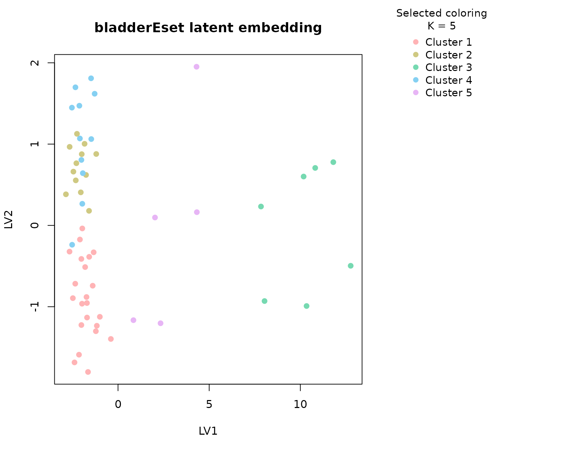
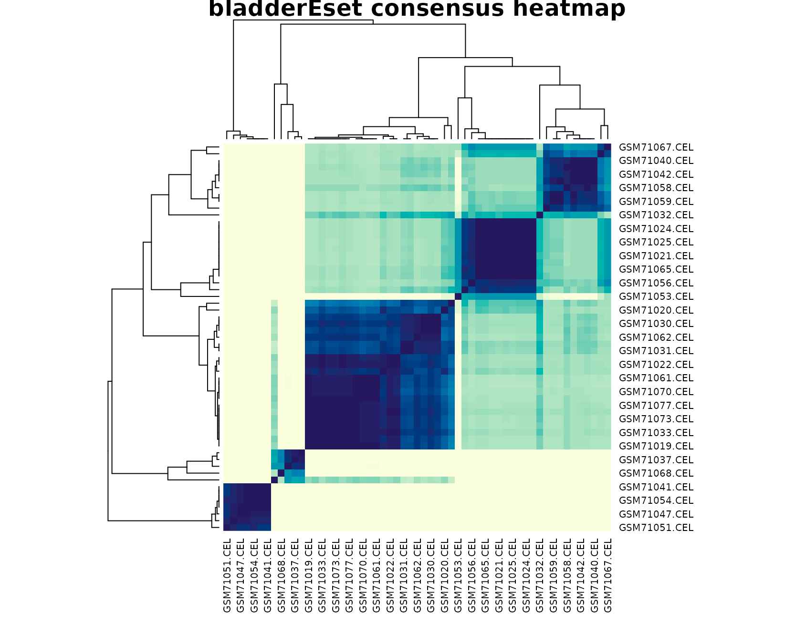

# bladderEset

## Background

`bladderEset` is distributed through the Bioconductor `bladderbatch`
experiment package and is widely used to illustrate both biological
heterogeneity and batch effects in bladder cancer expression studies.
`uccdf` ships a reduced version called `bladder_gene_panel` that keeps a
small set of highly variable probe sets together with pathology labels
and the processing batch annotation.

This dataset is valuable because the interpretation is not
one-dimensional. A cluster can reflect tumor state, pathology subtype,
technical batch, or a mixture of those effects. That makes it a more
realistic omics example than a perfectly separated textbook benchmark.

## Objective

The objective is to test whether the reduced bladder expression panel
supports a stable multi-cluster solution and to understand whether the
recovered groups are better explained by pathology status, by technical
batch, or by a blend of both. This matters because practical consensus
clustering is often used in exactly this kind of confounded setting.

## Data preparation

``` r
if (file.exists("data/bladder_gene_panel.rda")) {
  load("data/bladder_gene_panel.rda")
} else if (file.exists("../data/bladder_gene_panel.rda")) {
  load("../data/bladder_gene_panel.rda")
} else {
  data(bladder_gene_panel, package = "uccdf")
}
analysis_bladder <- bladder_gene_panel[, c(
  "sample_id", "202917_s_at", "217022_s_at", "207935_s_at", "211430_s_at",
  "202409_at", "205916_at", "214677_x_at", "212768_s_at"
)]
head(analysis_bladder)
#>                 sample_id 202917_s_at 217022_s_at 207935_s_at 211430_s_at
#> GSM71019.CEL GSM71019.CEL    8.228346   12.224411   10.713120   12.447222
#> GSM71020.CEL GSM71020.CEL    5.927838    5.054316   10.029341   12.702998
#> GSM71021.CEL GSM71021.CEL    4.595349    6.405009    9.420920    7.082336
#> GSM71022.CEL GSM71022.CEL    5.840905    9.962041    7.058879   10.895846
#> GSM71023.CEL GSM71023.CEL    8.979690   11.608943    8.158368   10.810691
#> GSM71024.CEL GSM71024.CEL    5.377329    8.029013   11.633022    7.332524
#>              202409_at 205916_at 214677_x_at 212768_s_at
#> GSM71019.CEL  5.731426  4.256044   12.478996   10.165109
#> GSM71020.CEL  6.479970  4.312322   12.683614    6.626511
#> GSM71021.CEL  6.479847  4.934869    7.025796    4.736950
#> GSM71022.CEL  6.300991  4.504071   11.450320    8.168055
#> GSM71023.CEL  5.593393  4.479845   11.536120    7.425503
#> GSM71024.CEL  5.697530  4.382480    8.454204    8.417084
```

``` r
table(bladder_gene_panel$outcome, useNA = "ifany")
#> 
#>   Biopsy     mTCC   Normal sTCC-CIS sTCC+CIS 
#>        9       12        8       16       12
table(bladder_gene_panel$batch, useNA = "ifany")
#> 
#>  1  2  3  4  5 
#> 11 18  4  5 19
```

## Analysis

``` r
fit_bladder <- fit_uccdf(
  analysis_bladder,
  id_column = "sample_id",
  candidate_k = 1:5,
  n_resamples = 20,
  n_null = 39,
  row_fraction = 0.9,
  col_fraction = 0.9,
  seed = 808
)

fit_bladder$selection
#> $alpha
#> [1] 0.05
#> 
#> $global_p_value
#> [1] 0.05
#> 
#> $null_family
#> [1] "independence_marginal_null"
#> 
#> $detected_structure
#> [1] TRUE
#> 
#> $best_exploratory_k
#> [1] 5
#> 
#> $best_supported_k
#> [1] 5
select_k(fit_bladder)
#>   k stability null_mean     null_sd stability_excess   z_score p_value
#> 1 2 0.9195408 0.9373595 0.009396423      -0.01781865 -1.896321   0.975
#> 2 3 0.6115658 0.5442753 0.041417173       0.06729052  1.624701   0.075
#> 3 4 0.5546565 0.4673998 0.031868249       0.08725669  2.738044   0.050
#> 4 5 0.5486842 0.4425853 0.021586814       0.10609894  4.914986   0.025
#>   supported objective
#> 1     FALSE -2.034950
#> 2     FALSE  1.404978
#> 3      TRUE  2.460785
#> 4      TRUE  4.593099
```

## Results

``` r
bladder_assign <- merge(
  augment(fit_bladder),
  bladder_gene_panel,
  by.x = "row_id",
  by.y = "sample_id",
  all.x = TRUE
)

head(bladder_assign)
#>         row_id cluster confidence  ambiguity exploratory_cluster
#> 1 GSM71019.CEL       1  0.9415465 0.05845350                   1
#> 2 GSM71020.CEL       1  0.8453090 0.15469099                   1
#> 3 GSM71021.CEL       2  0.9593979 0.04060210                   2
#> 4 GSM71022.CEL       1  0.9494775 0.05052250                   1
#> 5 GSM71023.CEL       1  0.9550336 0.04496638                   1
#> 6 GSM71024.CEL       2  0.9573365 0.04266348                   2
#>   exploratory_confidence exploratory_ambiguity assignment_mode selected_k
#> 1              0.9415465            0.05845350        selected          5
#> 2              0.8453090            0.15469099        selected          5
#> 3              0.9593979            0.04060210        selected          5
#> 4              0.9494775            0.05052250        selected          5
#> 5              0.9550336            0.04496638        selected          5
#> 6              0.9573365            0.04266348        selected          5
#>   exploratory_k 202917_s_at 217022_s_at 207935_s_at 211430_s_at 202409_at
#> 1             5    8.228346   12.224411   10.713120   12.447222  5.731426
#> 2             5    5.927838    5.054316   10.029341   12.702998  6.479970
#> 3             5    4.595349    6.405009    9.420920    7.082336  6.479847
#> 4             5    5.840905    9.962041    7.058879   10.895846  6.300991
#> 5             5    8.979690   11.608943    8.158368   10.810691  5.593393
#> 6             5    5.377329    8.029013   11.633022    7.332524  5.697530
#>   205916_at 214677_x_at 212768_s_at outcome batch cancer
#> 1  4.256044   12.478996   10.165109  Normal     3 Normal
#> 2  4.312322   12.683614    6.626511  Normal     2 Normal
#> 3  4.934869    7.025796    4.736950  Normal     2 Normal
#> 4  4.504071   11.450320    8.168055  Normal     3 Normal
#> 5  4.479845   11.536120    7.425503  Normal     3 Normal
#> 6  4.382480    8.454204    8.417084  Normal     3 Normal
```

``` r
aggregate(
  cbind(`202917_s_at`, `217022_s_at`, `207935_s_at`, `211430_s_at`,
        `202409_at`, `205916_at`, `214677_x_at`, `212768_s_at`, confidence) ~ cluster,
  bladder_assign,
  function(x) round(mean(x, na.rm = TRUE), 2)
)
#>   cluster 202917_s_at 217022_s_at 207935_s_at 211430_s_at 202409_at 205916_at
#> 1       1        8.94       10.94        8.33       11.42      6.64      4.45
#> 2       2        5.99        6.80        9.73        7.22      6.38      4.39
#> 3       3       12.48       11.54        9.62       12.70      8.35     11.28
#> 4       4        7.11        8.92       10.32        8.32     11.52      4.39
#> 5       5       10.34       10.74        9.06       11.43      9.28      7.03
#>   214677_x_at 212768_s_at confidence
#> 1       11.96        6.07       0.92
#> 2        7.44        4.26       0.92
#> 3       12.52        7.31       0.97
#> 4        9.12        4.53       0.82
#> 5       11.44        6.15       0.72
```

``` r
table(bladder_assign$cluster, bladder_assign$outcome)
#>    
#>     Biopsy mTCC Normal sTCC-CIS sTCC+CIS
#>   1      7    2      4        4        5
#>   2      2    0      4        4        2
#>   3      0    5      0        0        2
#>   4      0    2      0        7        2
#>   5      0    3      0        1        1
round(prop.table(table(bladder_assign$cluster, bladder_assign$outcome), margin = 1), 3)
#>    
#>     Biopsy  mTCC Normal sTCC-CIS sTCC+CIS
#>   1  0.318 0.091  0.182    0.182    0.227
#>   2  0.167 0.000  0.333    0.333    0.167
#>   3  0.000 0.714  0.000    0.000    0.286
#>   4  0.000 0.182  0.000    0.636    0.182
#>   5  0.000 0.600  0.000    0.200    0.200
```

``` r
table(bladder_assign$cluster, bladder_assign$batch)
#>    
#>     1 2 3 4 5
#>   1 2 4 3 4 9
#>   2 0 6 1 1 4
#>   3 5 0 0 0 2
#>   4 1 7 0 0 3
#>   5 3 1 0 0 1
round(prop.table(table(bladder_assign$cluster, bladder_assign$batch), margin = 1), 3)
#>    
#>         1     2     3     4     5
#>   1 0.091 0.182 0.136 0.182 0.409
#>   2 0.000 0.500 0.083 0.083 0.333
#>   3 0.714 0.000 0.000 0.000 0.286
#>   4 0.091 0.636 0.000 0.000 0.273
#>   5 0.600 0.200 0.000 0.000 0.200
```

``` r
plot_embedding(fit_bladder, color_by = "selected", main = "bladderEset latent embedding")
```



``` r
plot_consensus_heatmap(fit_bladder, main = "bladderEset consensus heatmap")
```



## Discussion

The bladder panel is more complicated than `ALL`, and that is precisely
why it is worth keeping in the tutorial set. The selected solution is
larger than two clusters, and the interpretation tables show that no
single explanatory factor fully accounts for every cluster. Some groups
are enriched for one pathology label, some are mixed, and some show a
noticeable batch preference. That means the consensus is capturing real
structure, but the structure is not purely biological in the simple
sense of one disease label per group.

This is an important practical lesson. In real omics work, a stable
cluster is not automatically a biological subtype. The bladder example
shows how `uccdf` helps with that distinction. The null calibration
tells us the multi-cluster pattern is stronger than a column-permuted
baseline, while the cross-tabulation against `outcome` and `batch` makes
it possible to inspect whether the stability is driven by interpretable
pathology, by technical effects, or by a combination of both.

The heatmap is particularly useful here. Instead of a clean two-block
layout, we usually see several consensus blocks with different levels of
separation. That visual pattern matches the selection output: the data
support multiple groups, but the boundaries are not equally sharp across
all samples.

## Interpretation

For `bladderEset`, the selected clusters should be interpreted as stable
expression-defined sample strata in a partially confounded study. Some
clusters track pathology more strongly, while others appear to absorb
residual batch or mixed heterogeneity. The right takeaway is therefore
not “these are definitive subtypes,” but rather “these are the recurrent
structures worth checking against pathology and batch before making a
biological claim.”
