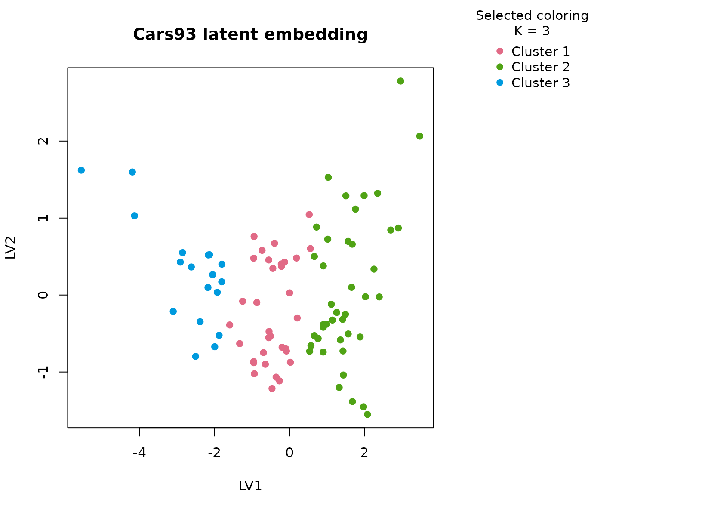

# Cars93

## Background

`Cars93` contains prices, performance, origin, drivetrain, and body type
for cars sold in the early 1990s. It is a practical transport-market
table with a rich mix of numeric and categorical descriptors. It is well
suited to `uccdf` because numerical scale alone does not fully define a
market segment: body type, origin, and drivetrain all contribute to how
a car is positioned.

## Objective

The aim is to identify stable market segments from the vehicle
specification table and to test whether those segments align with
recognizable product positioning differences such as economy-oriented
cars, heavier higher-power models, and intermediate mixed-use vehicles.

## Data preparation

``` r
cars93_df <- MASS::Cars93
cars93_df$sample_id <- sprintf("C%03d", seq_len(nrow(cars93_df)))
cars93_df$Cylinders <- ordered(as.character(cars93_df$Cylinders), levels = c("3", "4", "5", "6", "8", "rotary"))

analysis_cars93 <- cars93_df[, c(
  "sample_id", "Price", "MPG.city", "MPG.highway", "Horsepower", "Weight",
  "Type", "Origin", "DriveTrain", "Cylinders"
)]
head(analysis_cars93)
#>   sample_id Price MPG.city MPG.highway Horsepower Weight    Type  Origin
#> 1      C001  15.9       25          31        140   2705   Small non-USA
#> 2      C002  33.9       18          25        200   3560 Midsize non-USA
#> 3      C003  29.1       20          26        172   3375 Compact non-USA
#> 4      C004  37.7       19          26        172   3405 Midsize non-USA
#> 5      C005  30.0       22          30        208   3640 Midsize non-USA
#> 6      C006  15.7       22          31        110   2880 Midsize     USA
#>   DriveTrain Cylinders
#> 1      Front         4
#> 2      Front         6
#> 3      Front         6
#> 4      Front         6
#> 5       Rear         4
#> 6      Front         4
```

## Analysis

``` r
fit_cars93 <- fit_uccdf(
  analysis_cars93,
  id_column = "sample_id",
  candidate_k = 1:5,
  n_resamples = 20,
  n_null = 39,
  row_fraction = 0.85,
  col_fraction = 0.85,
  seed = 555
)

fit_cars93$selection
#> $alpha
#> [1] 0.05
#> 
#> $global_p_value
#> [1] 0.025
#> 
#> $null_family
#> [1] "independence_marginal_null"
#> 
#> $detected_structure
#> [1] TRUE
#> 
#> $best_exploratory_k
#> [1] 3
#> 
#> $best_supported_k
#> [1] 3
select_k(fit_cars93)
#>   k stability null_mean    null_sd stability_excess   z_score p_value supported
#> 1 2 0.4408780 0.2413262 0.02975131        0.1995518  6.707324   0.025      TRUE
#> 2 3 0.7025875 0.1516975 0.02194218        0.5508900 25.106428   0.025      TRUE
#> 3 4 0.6132028 0.1601077 0.02258329        0.4530951 20.063283   0.025      TRUE
#> 4 5 0.6319489 0.1934873 0.02556749        0.4384616 17.149177   0.025      TRUE
#>   objective
#> 1  6.568694
#> 2 24.886705
#> 3 19.786024
#> 4 16.827290
```

## Results

``` r
cars93_assign <- merge(augment(fit_cars93), cars93_df, by.x = "row_id", by.y = "sample_id", all.x = TRUE)
head(cars93_assign)
#>   row_id cluster confidence  ambiguity exploratory_cluster
#> 1   C001       1  0.7845914 0.21540863                   1
#> 2   C002       2  0.9670363 0.03296373                   2
#> 3   C003       2  0.9202935 0.07970653                   2
#> 4   C004       2  0.9675765 0.03242354                   2
#> 5   C005       2  0.9689653 0.03103469                   2
#> 6   C006       1  0.9294827 0.07051727                   1
#>   exploratory_confidence exploratory_ambiguity assignment_mode selected_k
#> 1              0.7845914            0.21540863        selected          3
#> 2              0.9670363            0.03296373        selected          3
#> 3              0.9202935            0.07970653        selected          3
#> 4              0.9675765            0.03242354        selected          3
#> 5              0.9689653            0.03103469        selected          3
#> 6              0.9294827            0.07051727        selected          3
#>   exploratory_k Manufacturer   Model    Type Min.Price Price Max.Price MPG.city
#> 1             3        Acura Integra   Small      12.9  15.9      18.8       25
#> 2             3        Acura  Legend Midsize      29.2  33.9      38.7       18
#> 3             3         Audi      90 Compact      25.9  29.1      32.3       20
#> 4             3         Audi     100 Midsize      30.8  37.7      44.6       19
#> 5             3          BMW    535i Midsize      23.7  30.0      36.2       22
#> 6             3        Buick Century Midsize      14.2  15.7      17.3       22
#>   MPG.highway            AirBags DriveTrain Cylinders EngineSize Horsepower
#> 1          31               None      Front         4        1.8        140
#> 2          25 Driver & Passenger      Front         6        3.2        200
#> 3          26        Driver only      Front         6        2.8        172
#> 4          26 Driver & Passenger      Front         6        2.8        172
#> 5          30        Driver only       Rear         4        3.5        208
#> 6          31        Driver only      Front         4        2.2        110
#>    RPM Rev.per.mile Man.trans.avail Fuel.tank.capacity Passengers Length
#> 1 6300         2890             Yes               13.2          5    177
#> 2 5500         2335             Yes               18.0          5    195
#> 3 5500         2280             Yes               16.9          5    180
#> 4 5500         2535             Yes               21.1          6    193
#> 5 5700         2545             Yes               21.1          4    186
#> 6 5200         2565              No               16.4          6    189
#>   Wheelbase Width Turn.circle Rear.seat.room Luggage.room Weight  Origin
#> 1       102    68          37           26.5           11   2705 non-USA
#> 2       115    71          38           30.0           15   3560 non-USA
#> 3       102    67          37           28.0           14   3375 non-USA
#> 4       106    70          37           31.0           17   3405 non-USA
#> 5       109    69          39           27.0           13   3640 non-USA
#> 6       105    69          41           28.0           16   2880     USA
#>            Make
#> 1 Acura Integra
#> 2  Acura Legend
#> 3       Audi 90
#> 4      Audi 100
#> 5      BMW 535i
#> 6 Buick Century
```

``` r
aggregate(
  cbind(Price, MPG.city, MPG.highway, Horsepower, Weight, confidence) ~ cluster,
  cars93_assign,
  function(x) round(mean(x, na.rm = TRUE), 2)
)
#>   cluster Price MPG.city MPG.highway Horsepower  Weight confidence
#> 1       1 16.15    22.79       29.79     122.21 2850.91       0.88
#> 2       2 26.28    18.17       25.14     186.29 3604.40       0.94
#> 3       3  9.88    31.39       37.00      84.39 2239.72       0.90
```

``` r
table(cars93_assign$cluster, cars93_assign$Type)
#>    
#>     Compact Large Midsize Small Sporty Van
#>   1      15     0       7     5      6   0
#>   2       1    11      15     0      6   9
#>   3       0     0       0    16      2   0
table(cars93_assign$cluster, cars93_assign$Origin)
#>    
#>     USA non-USA
#>   1  18      15
#>   2  25      17
#>   3   5      13
table(cars93_assign$cluster, cars93_assign$DriveTrain)
#>    
#>     4WD Front Rear
#>   1   3    27    3
#>   2   6    23   13
#>   3   1    17    0
round(prop.table(table(cars93_assign$cluster, cars93_assign$Type), margin = 1), 3)
#>    
#>     Compact Large Midsize Small Sporty   Van
#>   1   0.455 0.000   0.212 0.152  0.182 0.000
#>   2   0.024 0.262   0.357 0.000  0.143 0.214
#>   3   0.000 0.000   0.000 0.889  0.111 0.000
```

``` r
plot_embedding(fit_cars93, color_by = "selected", main = "Cars93 latent embedding")
```



``` r
plot_consensus_heatmap(fit_cars93, main = "Cars93 consensus heatmap")
```


## Discussion

The selected three-cluster solution is well matched to the dataset
because the vehicle space is visibly multi-modal. The numeric summaries
usually separate a lighter, higher-efficiency cluster from a heavier,
more powerful cluster, with a third group occupying the middle of the
market. The `Type` and `DriveTrain` tables make this easier to read: the
clusters are not arbitrary numeric slices, but mixtures of body format,
engineering style, and performance level.

This is also a good example of why a mixed workflow matters. If we
clustered on price and horsepower alone, some body-type information
would be lost. Here the consensus segmentation remains anchored in
numeric structure but becomes easier to name because categorical
descriptors move with the clusters rather than being ignored.

## Interpretation

For `Cars93`, the clusters are best interpreted as stable market
segments such as economy-oriented cars, mid-range mixed vehicles, and
heavier higher-power models. The precise marketing label is less
important than the fact that the partition is stable across resamples,
visible in the heatmap, and supported against the null baseline rather
than being a one-off clustering artifact.
