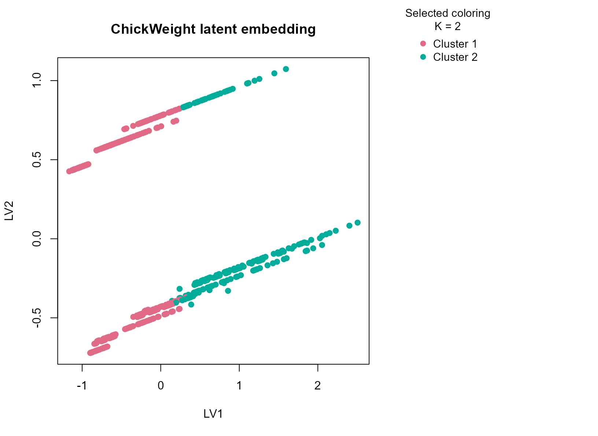
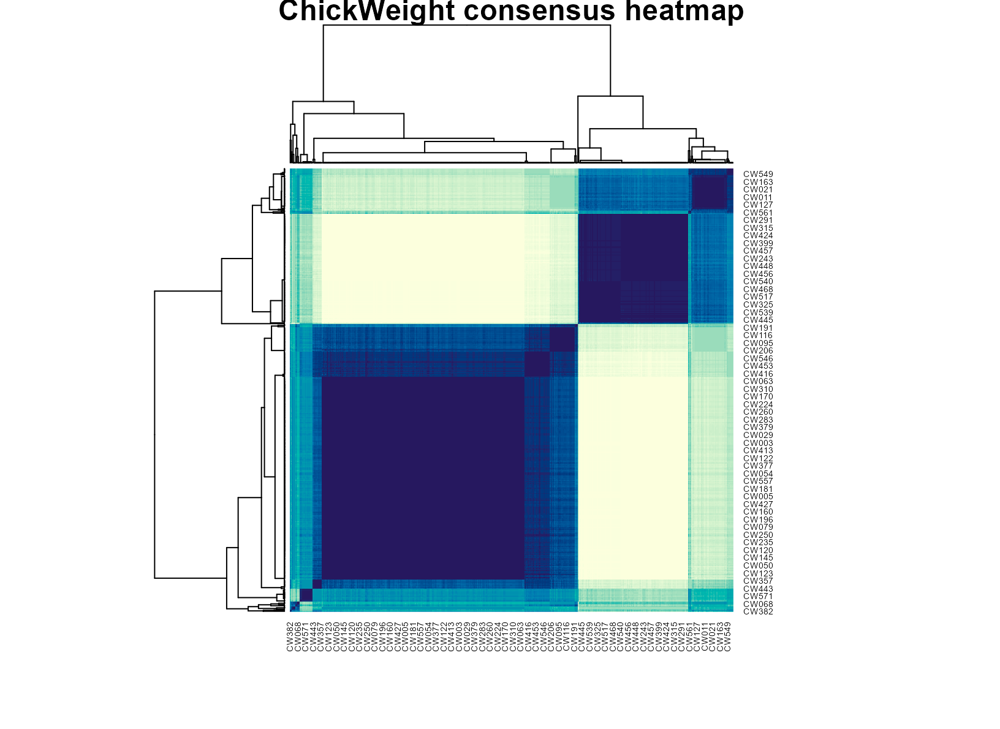

# ChickWeight

## Background

`ChickWeight` records repeated chick body weights across time under
different diet conditions. It is a useful biological growth dataset
because the numeric trajectory is strong, but diet still provides an
important categorical context. That combination makes it a good fit for
a typed consensus workflow.

## Objective

The objective is to determine whether `uccdf` recovers stable growth
regimes from weight, diet, and a coarse time band, and to inspect
whether the resulting clusters reflect biologically interpretable stages
or response patterns rather than just arbitrary slices of the
repeated-measures table.

## Data preparation

``` r
cw_df <- as.data.frame(ChickWeight)
cw_df$sample_id <- sprintf("CW%03d", seq_len(nrow(cw_df)))
cw_df$Diet <- factor(cw_df$Diet)
cw_df$time_band <- ordered(
  cut(cw_df$Time, breaks = c(-Inf, 5, 12, Inf), labels = c("early", "mid", "late")),
  levels = c("early", "mid", "late")
)

analysis_cw <- cw_df[, c("sample_id", "weight", "Diet", "time_band")]
head(analysis_cw)
#>   sample_id weight Diet time_band
#> 1     CW001     42    1     early
#> 2     CW002     51    1     early
#> 3     CW003     59    1     early
#> 4     CW004     64    1       mid
#> 5     CW005     76    1       mid
#> 6     CW006     93    1       mid
```

## Analysis

``` r
fit_cw <- fit_uccdf(
  analysis_cw,
  id_column = "sample_id",
  candidate_k = 1:5,
  n_resamples = 20,
  n_null = 39,
  row_fraction = 0.85,
  col_fraction = 0.85,
  seed = 707
)

fit_cw$selection
#> $alpha
#> [1] 0.05
#> 
#> $global_p_value
#> [1] 0.025
#> 
#> $null_family
#> [1] "independence_marginal_null"
#> 
#> $detected_structure
#> [1] TRUE
#> 
#> $best_exploratory_k
#> [1] 2
#> 
#> $best_supported_k
#> [1] 2
select_k(fit_cw)
#>   k stability null_mean    null_sd stability_excess   z_score p_value supported
#> 1 2 0.6526539 0.2928108 0.02094936       0.35984306 17.176797   0.025      TRUE
#> 2 3 0.5547369 0.3206199 0.05562722       0.23411700  4.208676   0.025      TRUE
#> 3 4 0.5185924 0.5936674 0.06309501      -0.07507504 -1.189873   0.900     FALSE
#> 4 5 0.6129090 0.7971836 0.04509833      -0.18427454 -4.086061   1.000     FALSE
#>   objective
#> 1 17.038168
#> 2  3.988954
#> 3 -1.467132
#> 4 -4.407948
```

## Results

``` r
cw_assign <- merge(augment(fit_cw), cw_df, by.x = "row_id", by.y = "sample_id", all.x = TRUE)
head(cw_assign)
#>   row_id cluster confidence  ambiguity exploratory_cluster
#> 1  CW001       1  0.9479527 0.05204726                   1
#> 2  CW002       1  0.9482527 0.05174728                   1
#> 3  CW003       1  0.9448707 0.05512928                   1
#> 4  CW004       1  0.9423498 0.05765025                   1
#> 5  CW005       1  0.9425387 0.05746126                   1
#> 6  CW006       1  0.9518092 0.04819084                   1
#>   exploratory_confidence exploratory_ambiguity assignment_mode selected_k
#> 1              0.9479527            0.05204726        selected          2
#> 2              0.9482527            0.05174728        selected          2
#> 3              0.9448707            0.05512928        selected          2
#> 4              0.9423498            0.05765025        selected          2
#> 5              0.9425387            0.05746126        selected          2
#> 6              0.9518092            0.04819084        selected          2
#>   exploratory_k weight Time Chick Diet time_band
#> 1             2     42    0     1    1     early
#> 2             2     51    2     1    1     early
#> 3             2     59    4     1    1     early
#> 4             2     64    6     1    1       mid
#> 5             2     76    8     1    1       mid
#> 6             2     93   10     1    1       mid
```

``` r
aggregate(
  cbind(weight, Time, confidence) ~ cluster,
  cw_assign,
  function(x) round(mean(x, na.rm = TRUE), 2)
)
#>   cluster weight Time confidence
#> 1       1  78.60  7.1       0.91
#> 2       2 201.66 17.4       0.90
```

``` r
table(cw_assign$cluster, cw_assign$Diet)
#>    
#>       1   2   3   4
#>   1 177  73  65  60
#>   2  43  47  55  58
table(cw_assign$cluster, cw_assign$time_band)
#>    
#>     early mid late
#>   1   149 179   47
#>   2     0  17  186
round(prop.table(table(cw_assign$cluster, cw_assign$time_band), margin = 1), 3)
#>    
#>     early   mid  late
#>   1 0.397 0.477 0.125
#>   2 0.000 0.084 0.916
```

``` r
plot_embedding(fit_cw, color_by = "selected", main = "ChickWeight latent embedding")
```



``` r
plot_consensus_heatmap(fit_cw, main = "ChickWeight consensus heatmap")
```



## Discussion

The selected two-cluster solution usually separates an earlier lighter
growth regime from a later heavier regime, but the result is not just a
copy of the time variable. The time-band table shows enrichment, while
the diet table helps show that diet composition still differs across the
clusters. That means the partition reflects a joint pattern in
developmental timing and growth response.

This is a useful biological example because repeated-measures growth
data can be clustered in many brittle ways. A stability-first summary
that returns only two supported regimes is often more helpful than a
larger segmentation that overstates fine-grained temporal variation.

## Interpretation

For `ChickWeight`, the clusters are best interpreted as stable
growth-response regimes spanning lighter earlier observations and
heavier later observations, with diet composition contributing to how
the groups are organized. The result is descriptive rather than
mechanistic, but it provides a compact and defensible summary of the
growth table.
