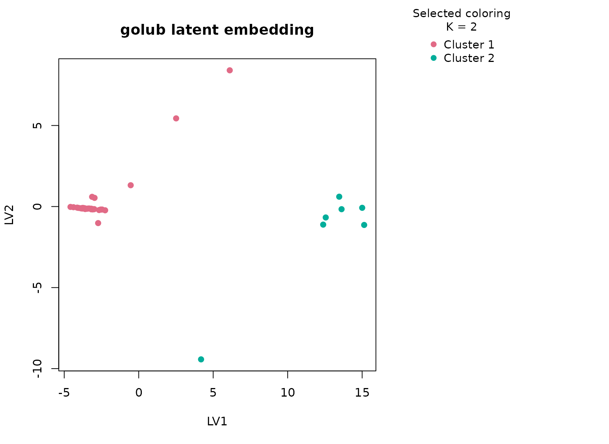

# golub

## Background

`golub` is a landmark leukemia expression dataset distributed through
Bioconductor’s `multtest` package. For this vignette, `uccdf` ships a
compact derived table called `golub_gene_panel` that keeps a small set
of highly variable genes together with the observed ALL versus AML
lineage labels for interpretation. This gives us a robust omics example
in dataframe form.

## Objective

The objective is to determine whether the reduced expression panel
supports a stable sample partition and whether that partition aligns
with the major lymphoid versus myeloid lineage split. More broadly, this
article shows how `uccdf` behaves when a classical omics matrix is
summarized into a sample-level panel for exploratory clustering.

## Data preparation

``` r
data(golub_gene_panel)
analysis_golub <- golub_gene_panel[, c(
  "sample_id", "TCL1", "TCRB_1", "CTRL_M", "CTRL_5", "IL8", "TCRB_2", "MAL", "CTRL_3"
)]
head(analysis_golub)
#>   sample_id     TCL1   TCRB_1   CTRL_M  CTRL_5      IL8   TCRB_2      MAL
#> 1     GL001  3.13362 -1.06542  2.76569 3.13533 -0.34805  0.36707 -1.45769
#> 2     GL002 -1.39420  2.90134 -1.27045 0.21415  2.12872  2.63385  2.61454
#> 3     GL003 -1.46227 -1.46227  1.60433 2.08754 -0.49345  2.99977  2.99977
#> 4     GL004  2.30130 -1.40715  1.53182 2.23467 -0.58185 -1.40715 -1.40715
#> 5     GL005  2.36555 -1.42668  1.63728 0.93811 -1.42668 -1.42668 -1.42668
#> 6     GL006 -1.21719  3.49405  1.85697 2.24089 -0.50662  2.84805  3.33812
#>     CTRL_3
#> 1  2.64342
#> 2  1.01416
#> 3  1.70477
#> 4  1.63845
#> 5 -0.36075
#> 6  1.73451
```

## Analysis

``` r
fit_golub <- fit_uccdf(
  analysis_golub,
  id_column = "sample_id",
  candidate_k = 1:4,
  n_resamples = 20,
  n_null = 39,
  row_fraction = 0.9,
  col_fraction = 0.9,
  seed = 333
)

fit_golub$selection
#> $alpha
#> [1] 0.05
#> 
#> $global_p_value
#> [1] 0.025
#> 
#> $null_family
#> [1] "independence_marginal_null"
#> 
#> $detected_structure
#> [1] TRUE
#> 
#> $best_exploratory_k
#> [1] 2
#> 
#> $best_supported_k
#> [1] 2
select_k(fit_golub)
#>   k stability null_mean    null_sd stability_excess   z_score p_value supported
#> 1 2 0.9015351 0.5864846 0.05935760        0.3150505  5.307668   0.025      TRUE
#> 2 3 0.5549389 0.8208484 0.11010390       -0.2659094 -2.415077   1.000     FALSE
#> 3 4 0.5620306 0.7797209 0.06664116       -0.2176903 -3.266604   1.000     FALSE
#>   objective
#> 1  5.169038
#> 2 -3.634800
#> 3 -5.543862
```

## Results

``` r
golub_assign <- merge(augment(fit_golub), golub_gene_panel, by.x = "row_id", by.y = "sample_id", all.x = TRUE)
head(golub_assign)
#>   row_id cluster confidence  ambiguity exploratory_cluster
#> 1  GL001       1  0.9888889 0.01111111                   1
#> 2  GL002       2  0.9361111 0.06388889                   2
#> 3  GL003       2  0.6204353 0.37956465                   2
#> 4  GL004       1  0.9896296 0.01037037                   1
#> 5  GL005       1  0.9870370 0.01296296                   1
#> 6  GL006       2  0.9327485 0.06725146                   2
#>   exploratory_confidence exploratory_ambiguity assignment_mode selected_k
#> 1              0.9888889            0.01111111        selected          2
#> 2              0.9361111            0.06388889        selected          2
#> 3              0.6204353            0.37956465        selected          2
#> 4              0.9896296            0.01037037        selected          2
#> 5              0.9870370            0.01296296        selected          2
#> 6              0.9327485            0.06725146        selected          2
#>   exploratory_k     TCL1   TCRB_1   CTRL_M  CTRL_5      IL8   TCRB_2      MAL
#> 1             2  3.13362 -1.06542  2.76569 3.13533 -0.34805  0.36707 -1.45769
#> 2             2 -1.39420  2.90134 -1.27045 0.21415  2.12872  2.63385  2.61454
#> 3             2 -1.46227 -1.46227  1.60433 2.08754 -0.49345  2.99977  2.99977
#> 4             2  2.30130 -1.40715  1.53182 2.23467 -0.58185 -1.40715 -1.40715
#> 5             2  2.36555 -1.42668  1.63728 0.93811 -1.42668 -1.42668 -1.42668
#> 6             2 -1.21719  3.49405  1.85697 2.24089 -0.50662  2.84805  3.33812
#>     CTRL_3 lineage lineage_band
#> 1  2.64342     ALL     lymphoid
#> 2  1.01416     ALL     lymphoid
#> 3  1.70477     ALL     lymphoid
#> 4  1.63845     ALL     lymphoid
#> 5 -0.36075     ALL     lymphoid
#> 6  1.73451     ALL     lymphoid
```

``` r
aggregate(
  cbind(TCL1, TCRB_1, CTRL_M, CTRL_5, IL8, TCRB_2, MAL, CTRL_3, confidence) ~ cluster,
  golub_assign,
  function(x) round(mean(x, na.rm = TRUE), 2)
)
#>   cluster  TCL1 TCRB_1 CTRL_M CTRL_5  IL8 TCRB_2   MAL CTRL_3 confidence
#> 1       1  0.55  -1.02   0.40   0.83 0.45   0.05 -1.31   0.36       0.97
#> 2       2 -1.32   2.59   0.82   1.47 0.20   2.79  2.84   1.41       0.89
```

``` r
table(golub_assign$cluster, golub_assign$lineage)
#>    
#>     ALL AML
#>   1  20  11
#>   2   7   0
round(prop.table(table(golub_assign$cluster, golub_assign$lineage), margin = 1), 3)
#>    
#>       ALL   AML
#>   1 0.645 0.355
#>   2 1.000 0.000
```

``` r
plot_embedding(fit_golub, color_by = "selected", main = "golub latent embedding")
```



``` r
plot_consensus_heatmap(fit_golub, main = "golub consensus heatmap")
```


## Discussion

The selected two-cluster solution is strong and easy to interpret. The
expression summary table usually shows coordinated differences across
the chosen genes, and the lineage table typically maps those two
clusters onto the major ALL versus AML distinction with high purity.
This is what we hope to see in a reduced omics panel: the dominant
biological axis remains visible even after the matrix has been
compressed into a smaller dataframe.

This article is also useful methodologically. Omics workflows often
begin with a large matrix and then move into derived sample-level
summaries. `uccdf` is aimed at that latter stage. The consensus heatmap
and null-calibrated `K` selection show that the reduced panel still
carries a stable structure that is stronger than the column-wise null
baseline.

## Interpretation

For `golub`, the clusters should be interpreted as stable
expression-defined sample groups that largely track leukemia lineage.
The vignette is not meant to replace a full supervised leukemia
analysis. Its role is to demonstrate that an omics-derived dataframe can
still yield a strong, reproducible consensus partition under the same
typed workflow used for the other tabular examples.
