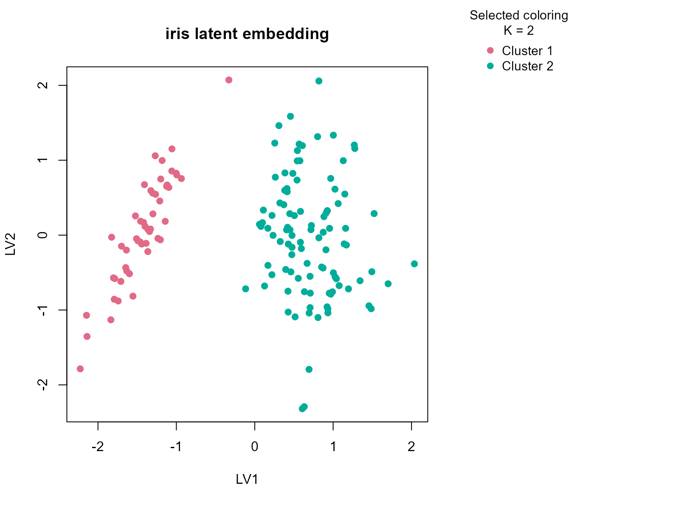
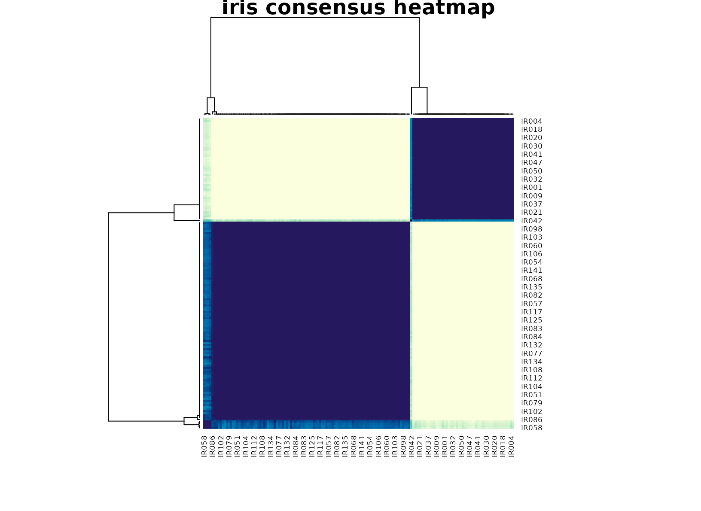

# iris

## Background

`iris` is the canonical morphology clustering dataset. It is mostly
continuous, but it is still useful in `uccdf` because we can add a small
ordinal feature and ask how the consensus workflow behaves on a familiar
real benchmark. Because the species labels are known, the dataset is
also useful for showing what a stability-first clustering summary does
when the supervised class count and the most reproducible unsupervised
structure are not identical.

## Objective

The goal is to inspect whether `uccdf` recovers a stable species-related
structure from the morphology table and to compare the resulting
clusters against the known `Species` label, with special attention to
whether the method prefers the strongest coarse split or the full
three-species partition.

## Data preparation

``` r
iris_df <- iris
iris_df$sample_id <- sprintf("IR%03d", seq_len(nrow(iris_df)))
iris_df$petal_band <- ordered(
  cut(iris_df$Petal.Length, breaks = c(-Inf, 2.5, 5, Inf), labels = c("short", "medium", "long")),
  levels = c("short", "medium", "long")
)

analysis_iris <- iris_df[, c("sample_id", "Sepal.Length", "Sepal.Width", "Petal.Length", "Petal.Width", "petal_band")]
head(analysis_iris)
#>   sample_id Sepal.Length Sepal.Width Petal.Length Petal.Width petal_band
#> 1     IR001          5.1         3.5          1.4         0.2      short
#> 2     IR002          4.9         3.0          1.4         0.2      short
#> 3     IR003          4.7         3.2          1.3         0.2      short
#> 4     IR004          4.6         3.1          1.5         0.2      short
#> 5     IR005          5.0         3.6          1.4         0.2      short
#> 6     IR006          5.4         3.9          1.7         0.4      short
```

## Analysis

``` r
fit_iris <- fit_uccdf(
  analysis_iris,
  id_column = "sample_id",
  candidate_k = 1:5,
  n_resamples = 24,
  n_null = 59,
  seed = 606
)

fit_iris$selection
#> $alpha
#> [1] 0.05
#> 
#> $global_p_value
#> [1] 0.01666667
#> 
#> $null_family
#> [1] "independence_marginal_null"
#> 
#> $detected_structure
#> [1] TRUE
#> 
#> $best_exploratory_k
#> [1] 2
#> 
#> $best_supported_k
#> [1] 2
select_k(fit_iris)
#>   k stability null_mean    null_sd stability_excess   z_score    p_value
#> 1 2 0.9532483 0.2018968 0.02169189        0.7513515 34.637416 0.01666667
#> 2 3 0.7057517 0.1822817 0.02413765        0.5234700 21.686856 0.01666667
#> 3 4 0.6396007 0.2756831 0.03575124        0.3639176 10.179157 0.01666667
#> 4 5 0.6845507 0.3860058 0.04028842        0.2985449  7.410189 0.01666667
#>   supported objective
#> 1      TRUE 34.498787
#> 2      TRUE 21.467134
#> 3      TRUE  8.901898
#> 4      TRUE  6.088301
```

## Results

``` r
iris_assign <- merge(
  augment(fit_iris),
  iris_df[, c("sample_id", "Species", "petal_band", "Sepal.Length", "Sepal.Width", "Petal.Length", "Petal.Width")],
  by.x = "row_id",
  by.y = "sample_id",
  all.x = TRUE
)
head(iris_assign)
#>   row_id cluster confidence   ambiguity exploratory_cluster
#> 1  IR001       1  0.9947671 0.005232863                   1
#> 2  IR002       1  0.9940476 0.005952381                   1
#> 3  IR003       1  0.9941043 0.005895692                   1
#> 4  IR004       1  0.9943311 0.005668935                   1
#> 5  IR005       1  0.9937642 0.006235828                   1
#> 6  IR006       1  0.9937642 0.006235828                   1
#>   exploratory_confidence exploratory_ambiguity assignment_mode selected_k
#> 1              0.9947671           0.005232863        selected          2
#> 2              0.9940476           0.005952381        selected          2
#> 3              0.9941043           0.005895692        selected          2
#> 4              0.9943311           0.005668935        selected          2
#> 5              0.9937642           0.006235828        selected          2
#> 6              0.9937642           0.006235828        selected          2
#>   exploratory_k Species petal_band Sepal.Length Sepal.Width Petal.Length
#> 1             2  setosa      short          5.1         3.5          1.4
#> 2             2  setosa      short          4.9         3.0          1.4
#> 3             2  setosa      short          4.7         3.2          1.3
#> 4             2  setosa      short          4.6         3.1          1.5
#> 5             2  setosa      short          5.0         3.6          1.4
#> 6             2  setosa      short          5.4         3.9          1.7
#>   Petal.Width
#> 1         0.2
#> 2         0.2
#> 3         0.2
#> 4         0.2
#> 5         0.2
#> 6         0.4
```

``` r
round(prop.table(table(iris_assign$cluster, iris_assign$Species), margin = 1), 3)
#>    
#>     setosa versicolor virginica
#>   1    1.0        0.0       0.0
#>   2    0.0        0.5       0.5
```

``` r
aggregate(
  cbind(Sepal.Length, Sepal.Width, Petal.Length, Petal.Width, confidence) ~ cluster,
  data = iris_assign,
  FUN = function(x) round(mean(x, na.rm = TRUE), 3)
)
#>   cluster Sepal.Length Sepal.Width Petal.Length Petal.Width confidence
#> 1       1        5.006       3.428        1.462       0.246      0.989
#> 2       2        6.262       2.872        4.906       1.676      0.987
```

``` r
plot_embedding(fit_iris, color_by = "selected", main = "iris latent embedding")
```



``` r
plot_consensus_heatmap(fit_iris, main = "iris consensus heatmap")
```



## Discussion

The selected two-cluster result is informative precisely because the
benchmark has three known species. The cluster-by-species table usually
shows that one consensus group is almost entirely setosa, while the
second mixes versicolor and virginica. That means the workflow is
prioritizing the strongest morphology boundary in the data, namely the
clean separation of setosa from the other two species, rather than
forcing the supervised class count into the unsupervised summary.

This is useful in practice because many real tables do not support a
uniquely correct `K`. A stable consensus summary can legitimately prefer
a coarser partition when the finer split is weaker or less reproducible,
and `iris` demonstrates that behavior in a very transparent way.

## Interpretation

That behavior should not be treated as a failure. On `iris`, `uccdf` is
telling us that the most reproducible structure in the morphology table
is a two-group separation, roughly corresponding to setosa versus
non-setosa. This is a clean example of stability-first clustering
producing a defensible reduced summary, even when a finer biologically
known label set exists.
