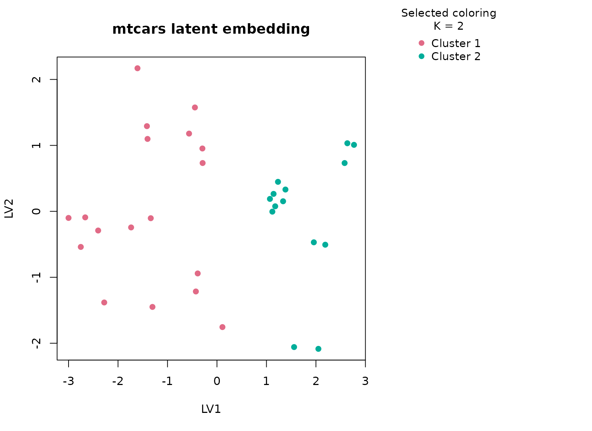

# mtcars

## Background

`mtcars` is a classic vehicle dataset with mostly continuous
specifications plus a few discrete engineering descriptors. It is a
convenient real example for mixed-table clustering in a transport
context. The table is also small enough that unstable high-`K`
segmentations are easy to invent, which makes it a good test of whether
`uccdf` stays conservative.

## Objective

The objective is to identify stable vehicle segments from performance
and design features and to see whether the resulting clusters line up
with transmission, cylinder structure, and broad efficiency-versus-power
tradeoffs.

## Data preparation

``` r
cars_df <- mtcars
cars_df$sample_id <- rownames(mtcars)
cars_df$am <- factor(cars_df$am, labels = c("automatic", "manual"))
cars_df$vs <- factor(cars_df$vs, labels = c("v-shaped", "straight"))
cars_df$cyl <- ordered(cars_df$cyl, levels = c(4, 6, 8))
cars_df$gear <- ordered(cars_df$gear, levels = c(3, 4, 5))

analysis_cars <- cars_df[, c("sample_id", "mpg", "disp", "hp", "wt", "qsec", "am", "vs", "cyl", "gear")]
head(analysis_cars)
#>                           sample_id  mpg disp  hp    wt  qsec        am
#> Mazda RX4                 Mazda RX4 21.0  160 110 2.620 16.46    manual
#> Mazda RX4 Wag         Mazda RX4 Wag 21.0  160 110 2.875 17.02    manual
#> Datsun 710               Datsun 710 22.8  108  93 2.320 18.61    manual
#> Hornet 4 Drive       Hornet 4 Drive 21.4  258 110 3.215 19.44 automatic
#> Hornet Sportabout Hornet Sportabout 18.7  360 175 3.440 17.02 automatic
#> Valiant                     Valiant 18.1  225 105 3.460 20.22 automatic
#>                         vs cyl gear
#> Mazda RX4         v-shaped   6    4
#> Mazda RX4 Wag     v-shaped   6    4
#> Datsun 710        straight   4    4
#> Hornet 4 Drive    straight   6    3
#> Hornet Sportabout v-shaped   8    3
#> Valiant           straight   6    3
```

## Analysis

``` r
fit_cars <- fit_uccdf(
  analysis_cars,
  id_column = "sample_id",
  candidate_k = 1:5,
  n_resamples = 24,
  n_null = 59,
  seed = 505
)

fit_cars$selection
#> $alpha
#> [1] 0.05
#> 
#> $global_p_value
#> [1] 0.01666667
#> 
#> $null_family
#> [1] "independence_marginal_null"
#> 
#> $detected_structure
#> [1] TRUE
#> 
#> $best_exploratory_k
#> [1] 2
#> 
#> $best_supported_k
#> [1] 2
select_k(fit_cars)
#>   k stability null_mean    null_sd stability_excess   z_score    p_value
#> 1 2 0.8387988 0.1772862 0.02777217        0.6615126 23.819257 0.01666667
#> 2 3 0.6798918 0.1827268 0.04397963        0.4971650 11.304435 0.01666667
#> 3 4 0.7665981 0.2908616 0.05826529        0.4757365  8.165005 0.01666667
#> 4 5 0.8471244 0.4070201 0.05628692        0.4401043  7.818944 0.01666667
#>   supported objective
#> 1      TRUE 23.680628
#> 2      TRUE 10.084712
#> 3      TRUE  6.887746
#> 4      TRUE  5.497056
```

## Results

``` r
cars_assign <- merge(
  augment(fit_cars),
  cars_df,
  by.x = "row_id",
  by.y = "sample_id",
  all.x = TRUE
)
head(cars_assign)
#>               row_id cluster confidence    ambiguity exploratory_cluster
#> 1        AMC Javelin       2  1.0000000 2.296675e-10                   2
#> 2 Cadillac Fleetwood       2  1.0000000 2.302158e-10                   2
#> 3         Camaro Z28       2  1.0000000 2.066626e-10                   2
#> 4  Chrysler Imperial       2  1.0000000 2.297518e-10                   2
#> 5         Datsun 710       1  0.9549241 4.507593e-02                   1
#> 6   Dodge Challenger       2  1.0000000 2.432375e-10                   2
#>   exploratory_confidence exploratory_ambiguity assignment_mode selected_k
#> 1              1.0000000          2.296675e-10        selected          2
#> 2              1.0000000          2.302158e-10        selected          2
#> 3              1.0000000          2.066626e-10        selected          2
#> 4              1.0000000          2.297518e-10        selected          2
#> 5              0.9549241          4.507593e-02        selected          2
#> 6              1.0000000          2.432375e-10        selected          2
#>   exploratory_k  mpg cyl disp  hp drat    wt  qsec       vs        am gear carb
#> 1             2 15.2   8  304 150 3.15 3.435 17.30 v-shaped automatic    3    2
#> 2             2 10.4   8  472 205 2.93 5.250 17.98 v-shaped automatic    3    4
#> 3             2 13.3   8  350 245 3.73 3.840 15.41 v-shaped automatic    3    4
#> 4             2 14.7   8  440 230 3.23 5.345 17.42 v-shaped automatic    3    4
#> 5             2 22.8   4  108  93 3.85 2.320 18.61 straight    manual    4    1
#> 6             2 15.5   8  318 150 2.76 3.520 16.87 v-shaped automatic    3    2
```

``` r
aggregate(
  cbind(mpg, disp, hp, wt, qsec, confidence) ~ cluster,
  data = cars_assign,
  FUN = function(x) round(mean(x, na.rm = TRUE), 2)
)
#>   cluster   mpg   disp     hp   wt  qsec confidence
#> 1       1 23.97 135.54  98.06 2.61 18.69       0.92
#> 2       2 15.10 353.10 209.21 4.00 16.77       1.00
```

``` r
table(cars_assign$cluster, cars_assign$am)
#>    
#>     automatic manual
#>   1         7     11
#>   2        12      2
table(cars_assign$cluster, cars_assign$cyl)
#>    
#>      4  6  8
#>   1 11  7  0
#>   2  0  0 14
round(prop.table(table(cars_assign$cluster, cars_assign$cyl), margin = 1), 3)
#>    
#>         4     6     8
#>   1 0.611 0.389 0.000
#>   2 0.000 0.000 1.000
```

``` r
plot_embedding(fit_cars, color_by = "selected", main = "mtcars latent embedding")
```



``` r
plot_consensus_heatmap(fit_cars, main = "mtcars consensus heatmap")
```


## Discussion

The selected two-cluster solution captures a broad division in vehicle
design and performance. One cluster typically contains lighter cars with
better fuel economy, smaller displacement, and lower horsepower, while
the other contains heavier and more powerful vehicles. The `am` and
`cyl` tables help confirm that this is a mechanically meaningful split
rather than a numerical artifact: automatic transmissions and larger
cylinder counts often enrich the heavier cluster, but they do not define
it perfectly on their own.

This is exactly the kind of table where a simpler stable partition is
more useful than a larger but less robust segmentation. The heatmap
usually shows two clear blocks with only a small number of boundary
cars, which supports the idea that the dominant structure is a
two-segment market split.

## Interpretation

For `mtcars`, the clusters are best read as stable vehicle segments such
as lighter efficiency-oriented cars versus heavier performance-oriented
cars. The article shows that even a mostly numeric engineering table
benefits from the typed consensus workflow once a few discrete
descriptors are included, because those descriptors help anchor the
interpretation of the numeric split.
