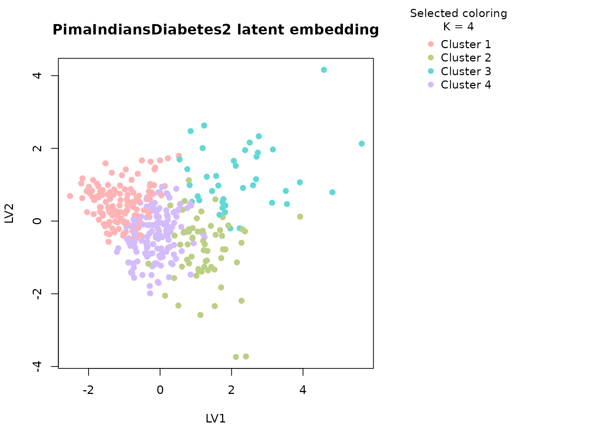
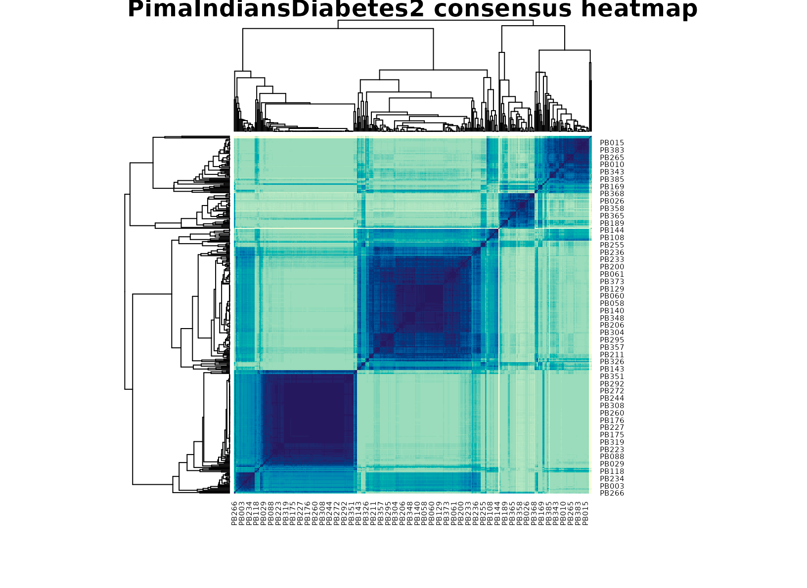

# PimaIndiansDiabetes2

## Background

`PimaIndiansDiabetes2` is a well-known clinical dataset containing
laboratory and anthropometric measurements related to diabetes risk.
`uccdf` ships a derived dataframe called `pima_biomarker_panel` that
keeps the biomarker-style measurements, age, an ordinal age band, and
the observed diabetes status for post hoc interpretation.

## Objective

The objective is to determine whether these biomarker measurements
support stable patient strata and whether the resulting groups
correspond to clinically recognizable combinations of glycemic burden,
adiposity, insulin levels, and age rather than to a single threshold on
one variable.

## Data preparation

``` r
data(pima_biomarker_panel)
analysis_pima <- pima_biomarker_panel[, c(
  "sample_id", "glucose", "pressure", "triceps", "insulin", "mass", "pedigree", "age_band"
)]
head(analysis_pima)
#>    sample_id glucose pressure triceps insulin mass pedigree age_band
#> 4      PB001      89       66      23      94 28.1    0.167    young
#> 5      PB002     137       40      35     168 43.1    2.288      mid
#> 7      PB003      78       50      32      88 31.0    0.248    young
#> 9      PB004     197       70      45     543 30.5    0.158    older
#> 14     PB005     189       60      23     846 30.1    0.398    older
#> 15     PB006     166       72      19     175 25.8    0.587    older
```

## Analysis

``` r
fit_pima <- fit_uccdf(
  analysis_pima,
  id_column = "sample_id",
  candidate_k = 1:5,
  n_resamples = 24,
  n_null = 39,
  row_fraction = 0.9,
  col_fraction = 0.9,
  seed = 124
)

fit_pima$selection
#> $alpha
#> [1] 0.05
#> 
#> $global_p_value
#> [1] 0.025
#> 
#> $null_family
#> [1] "independence_marginal_null"
#> 
#> $detected_structure
#> [1] TRUE
#> 
#> $best_exploratory_k
#> [1] 4
#> 
#> $best_supported_k
#> [1] 4
select_k(fit_pima)
#>   k stability null_mean    null_sd stability_excess   z_score p_value supported
#> 1 2 0.4002752 0.3657894 0.02700194       0.03448578 1.2771589   0.100     FALSE
#> 2 3 0.2272861 0.1575004 0.02304594       0.06978567 3.0281095   0.025      TRUE
#> 3 4 0.2066853 0.1327304 0.02150814       0.07395491 3.4384598   0.025      TRUE
#> 4 5 0.1631658 0.1418030 0.02221780       0.02136283 0.9615183   0.175     FALSE
#>    objective
#> 1  1.1385295
#> 2  2.8083870
#> 3  3.1612009
#> 4 -0.3603693
```

## Results

``` r
pima_assign <- merge(augment(fit_pima), pima_biomarker_panel, by.x = "row_id", by.y = "sample_id", all.x = TRUE)
head(pima_assign)
#>   row_id cluster confidence  ambiguity exploratory_cluster
#> 1  PB001       1  0.9133449 0.08665507                   1
#> 2  PB002       2  0.5314082 0.46859179                   2
#> 3  PB003       1  0.7004041 0.29959594                   1
#> 4  PB004       3  0.8739563 0.12604374                   3
#> 5  PB005       3  0.8008191 0.19918090                   3
#> 6  PB006       1  0.7446793 0.25532071                   1
#>   exploratory_confidence exploratory_ambiguity assignment_mode selected_k
#> 1              0.9133449            0.08665507        selected          4
#> 2              0.5314082            0.46859179        selected          4
#> 3              0.7004041            0.29959594        selected          4
#> 4              0.8739563            0.12604374        selected          4
#> 5              0.8008191            0.19918090        selected          4
#> 6              0.7446793            0.25532071        selected          4
#>   exploratory_k glucose pressure triceps insulin mass pedigree age age_band
#> 1             4      89       66      23      94 28.1    0.167  21    young
#> 2             4     137       40      35     168 43.1    2.288  33      mid
#> 3             4      78       50      32      88 31.0    0.248  26    young
#> 4             4     197       70      45     543 30.5    0.158  53    older
#> 5             4     189       60      23     846 30.1    0.398  59    older
#> 6             4     166       72      19     175 25.8    0.587  51    older
#>   diabetes
#> 1      neg
#> 2      pos
#> 3      pos
#> 4      pos
#> 5      pos
#> 6      pos
```

``` r
aggregate(
  cbind(glucose, pressure, triceps, insulin, mass, pedigree, age, confidence) ~ cluster,
  pima_assign,
  function(x) round(mean(x, na.rm = TRUE), 2)
)
#>   cluster glucose pressure triceps insulin  mass pedigree   age confidence
#> 1       1  104.46    64.68   19.84   97.12 26.74     0.50 26.73       0.87
#> 2       2  144.16    81.62   38.22  190.25 39.86     0.92 35.22       0.78
#> 3       3  161.23    70.36   32.26  428.46 35.41     0.48 35.33       0.83
#> 4       4  119.99    71.50   32.77  124.95 35.28     0.39 31.57       0.82
```

``` r
table(pima_assign$cluster, pima_assign$age_band)
#>    
#>     young mid older
#>   1   111  18     6
#>   2    24  26    13
#>   3    20   9    10
#>   4    93  47    15
table(pima_assign$cluster, pima_assign$diabetes)
#>    
#>     neg pos
#>   1 123  12
#>   2  19  44
#>   3  15  24
#>   4 105  50
round(prop.table(table(pima_assign$cluster, pima_assign$diabetes), margin = 1), 3)
#>    
#>       neg   pos
#>   1 0.911 0.089
#>   2 0.302 0.698
#>   3 0.385 0.615
#>   4 0.677 0.323
```

``` r
plot_embedding(fit_pima, color_by = "selected", main = "PimaIndiansDiabetes2 latent embedding")
```



``` r
plot_consensus_heatmap(fit_pima, main = "PimaIndiansDiabetes2 consensus heatmap")
```



## Discussion

The selected multi-cluster solution is useful because the table mixes
several biomarker axes that do not collapse to one measurement. In a
typical run, one cluster concentrates higher glucose and insulin burden,
another has lower glycemic measurements with more moderate
anthropometry, and additional groups capture intermediate or age-shifted
profiles. The diabetes table is helpful here: it usually shows
enrichment rather than perfect separation, which is what we would expect
from a biomarker panel rather than a supervised classifier.

This is precisely where a typed consensus workflow helps. A single
clustering run can overstate small differences in a moderately sized
clinical table, while a stability-first summary gives a more defensible
view of which patient strata are repeatedly supported by the data.

## Interpretation

For `PimaIndiansDiabetes2`, the clusters should be interpreted as stable
biomarker profiles, not as diagnostic categories. Their practical value
is that they summarize recurring metabolic patterns that can then be
compared against the observed diabetes status, age band, and individual
biomarker distributions without turning the clustering itself into a
prediction model.
