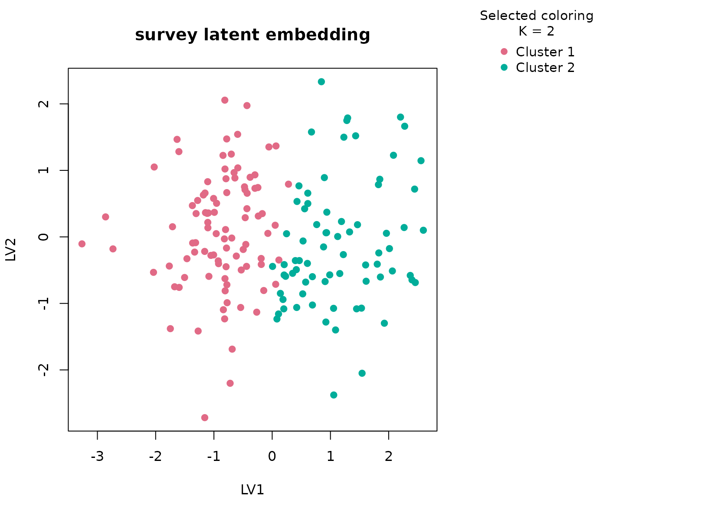
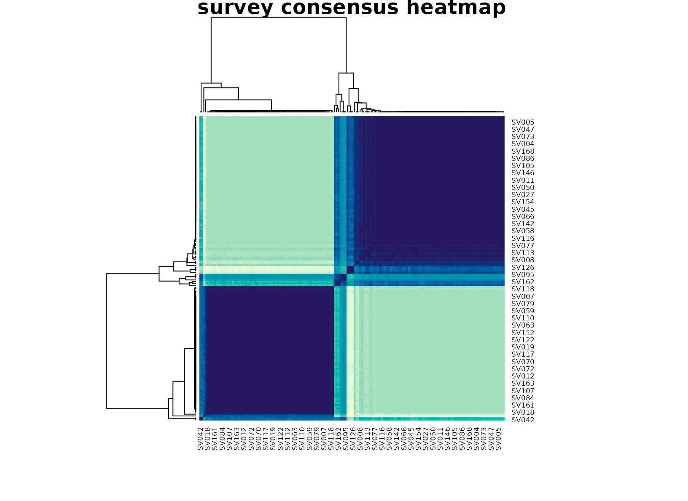

# survey

## Background

`survey` from `MASS` contains hand measurements, pulse, and
lifestyle-related categorical fields collected from students. It is a
useful example of a small social-science table with genuinely mixed
feature types. Unlike the more engineered benchmark datasets, this table
is noisy, behaviorally heterogeneous, and only partly standardized,
which makes it a realistic test of whether a consensus workflow can stay
conservative on ordinary human-subject data.

## Objective

The objective is to test whether `uccdf` can recover broad participant
strata from anthropometric and lifestyle variables after removing
incomplete rows. The intended use is exploratory: we want to see whether
the data support a stable low-dimensional grouping, not to claim latent
psychological classes.

## Data preparation

``` r
survey_df <- na.omit(MASS::survey)
survey_df$sample_id <- sprintf("SV%03d", seq_len(nrow(survey_df)))

analysis_survey <- survey_df[, c("sample_id", "Sex", "Wr.Hnd", "NW.Hnd", "W.Hnd", "Pulse", "Clap", "Exer", "Smoke")]
head(analysis_survey)
#>   sample_id    Sex Wr.Hnd NW.Hnd W.Hnd Pulse  Clap Exer Smoke
#> 1     SV001 Female   18.5   18.0 Right    92  Left Some Never
#> 2     SV002   Male   19.5   20.5  Left   104  Left None Regul
#> 5     SV003   Male   20.0   20.0 Right    35 Right Some Never
#> 6     SV004 Female   18.0   17.7 Right    64 Right Some Never
#> 7     SV005   Male   17.7   17.7 Right    83 Right Freq Never
#> 8     SV006 Female   17.0   17.3 Right    74 Right Freq Never
```

## Analysis

``` r
fit_survey <- fit_uccdf(
  analysis_survey,
  id_column = "sample_id",
  candidate_k = 1:5,
  n_resamples = 20,
  n_null = 39,
  row_fraction = 0.85,
  col_fraction = 0.85,
  min_cluster_size = 10,
  gamma_small_cluster = 3,
  seed = 444
)

fit_survey$selection
#> $alpha
#> [1] 0.05
#> 
#> $global_p_value
#> [1] 0.025
#> 
#> $null_family
#> [1] "independence_marginal_null"
#> 
#> $detected_structure
#> [1] TRUE
#> 
#> $best_exploratory_k
#> [1] 2
#> 
#> $best_supported_k
#> [1] 2
select_k(fit_survey)
#>   k stability null_mean    null_sd stability_excess   z_score p_value supported
#> 1 2 0.4757628 0.2131646 0.02205509        0.2625983 11.906467   0.025      TRUE
#> 2 3 0.2384683 0.1352887 0.01334014        0.1031796  7.734517   0.025      TRUE
#> 3 4 0.3070379 0.1356193 0.01269012        0.1714186 13.508027   0.025      TRUE
#> 4 5 0.3889049 0.1618483 0.02241246        0.2270566 10.130815   0.025      TRUE
#>   objective
#> 1 11.767838
#> 2  7.514794
#> 3 10.230768
#> 4  6.808927
```

## Results

``` r
survey_assign <- merge(augment(fit_survey), survey_df, by.x = "row_id", by.y = "sample_id", all.x = TRUE)
head(survey_assign)
#>   row_id cluster confidence   ambiguity exploratory_cluster
#> 1  SV001       1  0.9715891 0.028410881                   1
#> 2  SV002       2  0.8283253 0.171674673                   2
#> 3  SV003       2  0.9910185 0.008981525                   2
#> 4  SV004       1  0.9708227 0.029177341                   1
#> 5  SV005       1  0.9705191 0.029480885                   1
#> 6  SV006       1  0.9696065 0.030393496                   1
#>   exploratory_confidence exploratory_ambiguity assignment_mode selected_k
#> 1              0.9715891           0.028410881        selected          2
#> 2              0.8283253           0.171674673        selected          2
#> 3              0.9910185           0.008981525        selected          2
#> 4              0.9708227           0.029177341        selected          2
#> 5              0.9705191           0.029480885        selected          2
#> 6              0.9696065           0.030393496        selected          2
#>   exploratory_k    Sex Wr.Hnd NW.Hnd W.Hnd    Fold Pulse  Clap Exer Smoke
#> 1             2 Female   18.5   18.0 Right  R on L    92  Left Some Never
#> 2             2   Male   19.5   20.5  Left  R on L   104  Left None Regul
#> 3             2   Male   20.0   20.0 Right Neither    35 Right Some Never
#> 4             2 Female   18.0   17.7 Right  L on R    64 Right Some Never
#> 5             2   Male   17.7   17.7 Right  L on R    83 Right Freq Never
#> 6             2 Female   17.0   17.3 Right  R on L    74 Right Freq Never
#>   Height      M.I    Age
#> 1 173.00   Metric 18.250
#> 2 177.80 Imperial 17.583
#> 3 165.00   Metric 23.667
#> 4 172.72 Imperial 21.000
#> 5 182.88 Imperial 18.833
#> 6 157.00   Metric 35.833
```

``` r
aggregate(
  cbind(Wr.Hnd, NW.Hnd, Pulse, confidence) ~ cluster,
  survey_assign,
  function(x) round(mean(x, na.rm = TRUE), 2)
)
#>   cluster Wr.Hnd NW.Hnd Pulse confidence
#> 1       1  17.56  17.46 75.57       0.94
#> 2       2  20.38  20.35 72.05       0.98
```

``` r
table(survey_assign$cluster, survey_assign$Sex)
#>    
#>     Female Male
#>   1     82   12
#>   2      2   72
table(survey_assign$cluster, survey_assign$Clap)
#>    
#>     Left Neither Right
#>   1   17      21    56
#>   2   11      12    51
table(survey_assign$cluster, survey_assign$Exer)
#>    
#>     Freq None Some
#>   1   38    7   49
#>   2   47    7   20
round(prop.table(table(survey_assign$cluster, survey_assign$Sex), margin = 1), 3)
#>    
#>     Female  Male
#>   1  0.872 0.128
#>   2  0.027 0.973
```

``` r
plot_embedding(fit_survey, color_by = "selected", main = "survey latent embedding")
```



``` r
plot_consensus_heatmap(fit_survey, main = "survey consensus heatmap")
```



## Discussion

This dataset is noisier and less engineered than the others, which makes
it a better test of whether the package can handle ordinary mixed survey
data. The selected two-cluster solution is intentionally broad. In most
runs it reflects a mix of body-size variables such as writing and
non-writing hand span, together with a smaller behavioral component
visible in `Clap`, `Exer`, or `Smoke`. The sex table often shows
enrichment rather than perfect separation, which is the right outcome
for a mixed observational dataset of this kind.

The important point is that the consensus solution avoids
over-fragmenting the table. Without the small-cluster penalty, larger
`K` values can carve out tiny idiosyncratic groups driven by sparse
factor combinations. Here the selected result remains coarse enough to
be interpretable while still showing a stable structure stronger than
the null baseline.

## Interpretation

For `survey`, the clusters should be read as reproducible participant
strata defined by a blend of anthropometry and reported behavior. They
are not psychological or causal latent classes. The value of the
analysis is that it shows `uccdf` behaving conservatively on a messy
mixed survey table, where a stable two-group summary is often more
defensible than an aggressive high-resolution segmentation.
