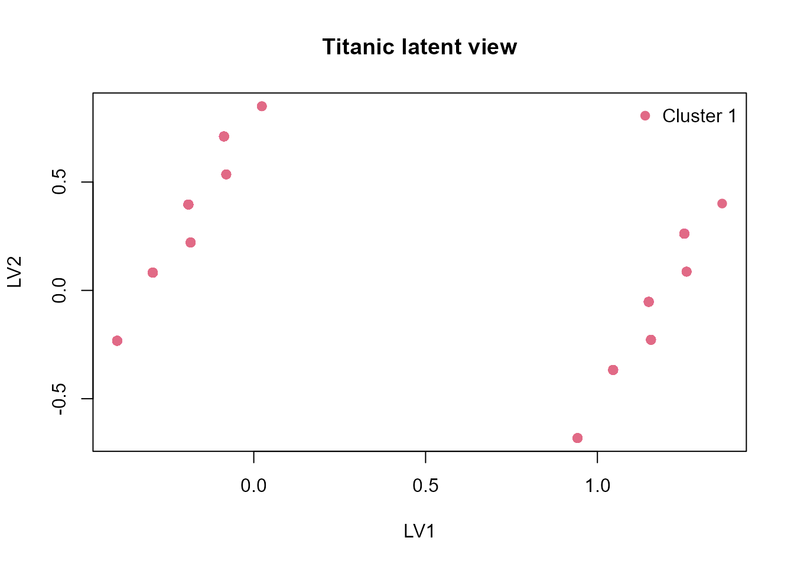

# Case Study: Titanic Passenger Structure

## Data preparation

The built-in `Titanic` dataset is a contingency table, so we first
expand it to one row per passenger and keep a compact mixed-type
clustering table.

``` r
titanic_df <- as.data.frame(Titanic)
titanic_rows <- titanic_df[rep(seq_len(nrow(titanic_df)), titanic_df$Freq), c("Class", "Sex", "Age", "Survived")]
names(titanic_rows) <- c("class", "sex", "age_group", "survived")
titanic_rows$passenger_id <- sprintf("P%04d", seq_len(nrow(titanic_rows)))
titanic_rows$class <- ordered(titanic_rows$class, levels = c("Crew", "3rd", "2nd", "1st"))
titanic_rows$sex <- factor(titanic_rows$sex)
titanic_rows$age_group <- factor(titanic_rows$age_group)
titanic_rows$survived <- factor(titanic_rows$survived)

head(titanic_rows)
#>     class  sex age_group survived passenger_id
#> 3     3rd Male     Child       No        P0001
#> 3.1   3rd Male     Child       No        P0002
#> 3.2   3rd Male     Child       No        P0003
#> 3.3   3rd Male     Child       No        P0004
#> 3.4   3rd Male     Child       No        P0005
#> 3.5   3rd Male     Child       No        P0006
```

## Fit the clustering workflow

``` r
fit_titanic <- fit_uccdf(
  titanic_rows[, c("passenger_id", "class", "sex", "age_group")],
  id_column = "passenger_id",
  candidate_k = 1:5,
  n_resamples = 20,
  n_null = 8,
  seed = 7
)

fit_titanic
#> uccdf fit
#> - samples: 2201
#> - active columns: 3
#> - selected_k: 1
#> - global_p_value: 0.4444
select_k(fit_titanic)
#>   k stability null_mean    null_sd     z_score   p_value p_adjusted  objective
#> 1 2 0.6824715 0.7994364 0.09257661 -1.26343893 1.0000000  1.0000000 -1.4020684
#> 2 3 0.6975981 0.6874397 0.11416367  0.08898071 0.7777778  1.0000000 -0.1307417
#> 3 4 0.6385707 0.6850318 0.01069070 -4.34594056 1.0000000  1.0000000 -4.6231994
#> 4 5 0.7976143 0.6808469 0.01787899  6.53097568 0.1111111  0.4444444  6.2090881
```

## Join assignments back to survival status

``` r
titanic_assign <- merge(
  augment(fit_titanic),
  titanic_rows,
  by.x = "row_id",
  by.y = "passenger_id",
  all.x = TRUE
)

head(titanic_assign)
#>   row_id cluster confidence ambiguity class  sex age_group survived
#> 1  P0001       1          1         0   3rd Male     Child       No
#> 2  P0002       1          1         0   3rd Male     Child       No
#> 3  P0003       1          1         0   3rd Male     Child       No
#> 4  P0004       1          1         0   3rd Male     Child       No
#> 5  P0005       1          1         0   3rd Male     Child       No
#> 6  P0006       1          1         0   3rd Male     Child       No
```

``` r
survival_by_cluster <- prop.table(table(titanic_assign$cluster, titanic_assign$survived), margin = 1)
round(survival_by_cluster, 3)
#>    
#>        No   Yes
#>   1 0.677 0.323
```

## Visual review

``` r
plot_embedding(fit_titanic, main = "Titanic latent view")
```



``` r
plot_consensus_heatmap(fit_titanic, main = "Titanic consensus heatmap")
```


## Interpretation

This is not a causal analysis of survival. The point of the case study
is to show that `uccdf` can recover structured passenger groupings from
a compact mixed table and then let us compare those groups to an
external field such as survival.
