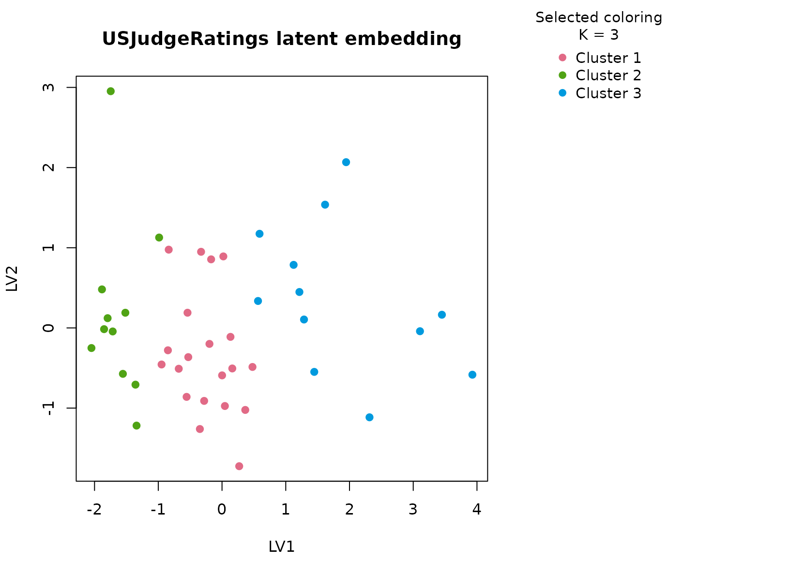

# USJudgeRatings

## Background

`USJudgeRatings` contains lawyer ratings of judges on several
professional dimensions such as integrity, demeanor, diligence, and
case-management ability. The table is useful because it mixes correlated
judicial evaluation scores with an ordinal band derived from one anchor
variable, producing a compact but non-trivial mixed dataset.

## Objective

The objective is to determine whether the rating table supports stable
judge profiles and whether those profiles reflect broad judicial
evaluation patterns rather than noise in any single score.

## Data preparation

``` r
judge_df <- as.data.frame(USJudgeRatings)
judge_df$sample_id <- rownames(judge_df)
judge_df$cont_band <- ordered(
  cut(judge_df$CONT, breaks = c(-Inf, 5.5, 7, Inf), labels = c("low", "mid", "high")),
  levels = c("low", "mid", "high")
)

analysis_judge <- judge_df[, c("sample_id", "CONT", "INTG", "DMNR", "DILG", "CFMG", "cont_band")]
head(analysis_judge)
#>                     sample_id CONT INTG DMNR DILG CFMG cont_band
#> AARONSON,L.H.   AARONSON,L.H.  5.7  7.9  7.7  7.3  7.1       mid
#> ALEXANDER,J.M. ALEXANDER,J.M.  6.8  8.9  8.8  8.5  7.8       mid
#> ARMENTANO,A.J. ARMENTANO,A.J.  7.2  8.1  7.8  7.8  7.5      high
#> BERDON,R.I.       BERDON,R.I.  6.8  8.8  8.5  8.8  8.3       mid
#> BRACKEN,J.J.     BRACKEN,J.J.  7.3  6.4  4.3  6.5  6.0      high
#> BURNS,E.B.         BURNS,E.B.  6.2  8.8  8.7  8.5  7.9       mid
```

## Analysis

``` r
fit_judge <- fit_uccdf(
  analysis_judge,
  id_column = "sample_id",
  candidate_k = 1:5,
  n_resamples = 20,
  n_null = 39,
  row_fraction = 0.85,
  col_fraction = 0.85,
  seed = 909
)

fit_judge$selection
#> $alpha
#> [1] 0.05
#> 
#> $global_p_value
#> [1] 0.025
#> 
#> $null_family
#> [1] "independence_marginal_null"
#> 
#> $detected_structure
#> [1] TRUE
#> 
#> $best_exploratory_k
#> [1] 3
#> 
#> $best_supported_k
#> [1] 3
select_k(fit_judge)
#>   k stability null_mean    null_sd stability_excess  z_score p_value supported
#> 1 2 0.5324215 0.2540963 0.06217102        0.2783252 4.476768   0.025      TRUE
#> 2 3 0.4227702 0.2009704 0.03782199        0.2217997 5.864305   0.025      TRUE
#> 3 4 0.5144709 0.2573416 0.04153754        0.2571292 6.190284   0.025      TRUE
#> 4 5 0.5600739 0.3460437 0.05067768        0.2140302 4.223362   0.025      TRUE
#>   objective
#> 1  4.338138
#> 2  5.644583
#> 3  4.913025
#> 4  1.901474
```

## Results

``` r
judge_assign <- merge(augment(fit_judge), judge_df, by.x = "row_id", by.y = "sample_id", all.x = TRUE)
head(judge_assign)
#>           row_id cluster confidence  ambiguity exploratory_cluster
#> 1  AARONSON,L.H.       1  0.8686998 0.13130021                   1
#> 2 ALEXANDER,J.M.       2  0.8321296 0.16787037                   2
#> 3 ARMENTANO,A.J.       1  0.9253230 0.07467698                   1
#> 4    BERDON,R.I.       2  0.8530159 0.14698413                   2
#> 5   BRACKEN,J.J.       3  0.6890183 0.31098175                   3
#> 6     BURNS,E.B.       2  0.7991667 0.20083333                   2
#>   exploratory_confidence exploratory_ambiguity assignment_mode selected_k
#> 1              0.8686998            0.13130021        selected          3
#> 2              0.8321296            0.16787037        selected          3
#> 3              0.9253230            0.07467698        selected          3
#> 4              0.8530159            0.14698413        selected          3
#> 5              0.6890183            0.31098175        selected          3
#> 6              0.7991667            0.20083333        selected          3
#>   exploratory_k CONT INTG DMNR DILG CFMG DECI PREP FAMI ORAL WRIT PHYS RTEN
#> 1             3  5.7  7.9  7.7  7.3  7.1  7.4  7.1  7.1  7.1  7.0  8.3  7.8
#> 2             3  6.8  8.9  8.8  8.5  7.8  8.1  8.0  8.0  7.8  7.9  8.5  8.7
#> 3             3  7.2  8.1  7.8  7.8  7.5  7.6  7.5  7.5  7.3  7.4  7.9  7.8
#> 4             3  6.8  8.8  8.5  8.8  8.3  8.5  8.7  8.7  8.4  8.5  8.8  8.7
#> 5             3  7.3  6.4  4.3  6.5  6.0  6.2  5.7  5.7  5.1  5.3  5.5  4.8
#> 6             3  6.2  8.8  8.7  8.5  7.9  8.0  8.1  8.0  8.0  8.0  8.6  8.6
#>   cont_band
#> 1       mid
#> 2       mid
#> 3      high
#> 4       mid
#> 5      high
#> 6       mid
```

``` r
aggregate(
  cbind(CONT, INTG, DMNR, DILG, CFMG, confidence) ~ cluster,
  judge_assign,
  function(x) round(mean(x, na.rm = TRUE), 2)
)
#>   cluster CONT INTG DMNR DILG CFMG confidence
#> 1       1 7.10 8.14 7.74 7.79 7.59       0.86
#> 2       2 7.58 8.85 8.71 8.67 8.35       0.87
#> 3       3 7.87 7.05 6.06 6.63 6.49       0.76
```

``` r
table(judge_assign$cluster, judge_assign$cont_band)
#>    
#>     low mid high
#>   1   0  10   10
#>   2   0   3    8
#>   3   0   3    9
round(prop.table(table(judge_assign$cluster, judge_assign$cont_band), margin = 1), 3)
#>    
#>       low   mid  high
#>   1 0.000 0.500 0.500
#>   2 0.000 0.273 0.727
#>   3 0.000 0.250 0.750
```

``` r
plot_embedding(fit_judge, color_by = "selected", main = "USJudgeRatings latent embedding")
```



``` r
plot_consensus_heatmap(fit_judge, main = "USJudgeRatings consensus heatmap")
```


## Discussion

The selected two-cluster solution typically separates judges with
stronger ratings across multiple professional dimensions from those with
more moderate scores. The important point is that the separation is
multivariate: integrity, demeanor, diligence, and case-management scores
tend to move together, so the clusters are not driven by `CONT` alone
even though the ordinal band is useful for interpretation.

This analysis is a good example of a table where the dominant structure
is broad rather than fine-grained. A stability-first method is therefore
appropriate, because an aggressive high-`K` partition would be easy to
over-interpret as judicial “types” when the data may only support a
coarse favorable-versus-more- moderate distinction.

## Interpretation

For `USJudgeRatings`, the clusters should be interpreted as stable
judicial evaluation profiles defined by jointly higher versus more
moderate professional ratings. They are not normative categories of
judges. Their purpose is to give a reproducible exploratory summary of
the ratings table that can be inspected with both numeric summaries and
consensus structure plots.
