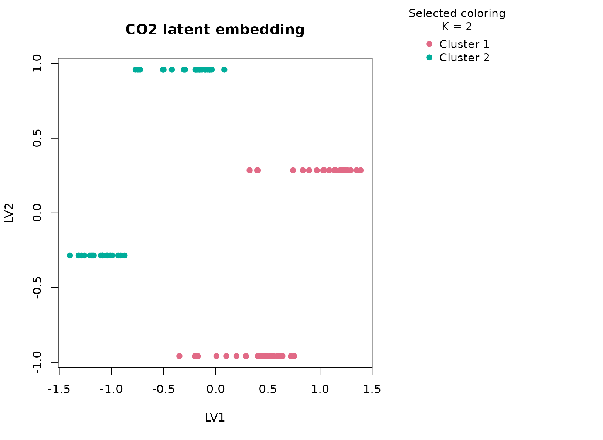
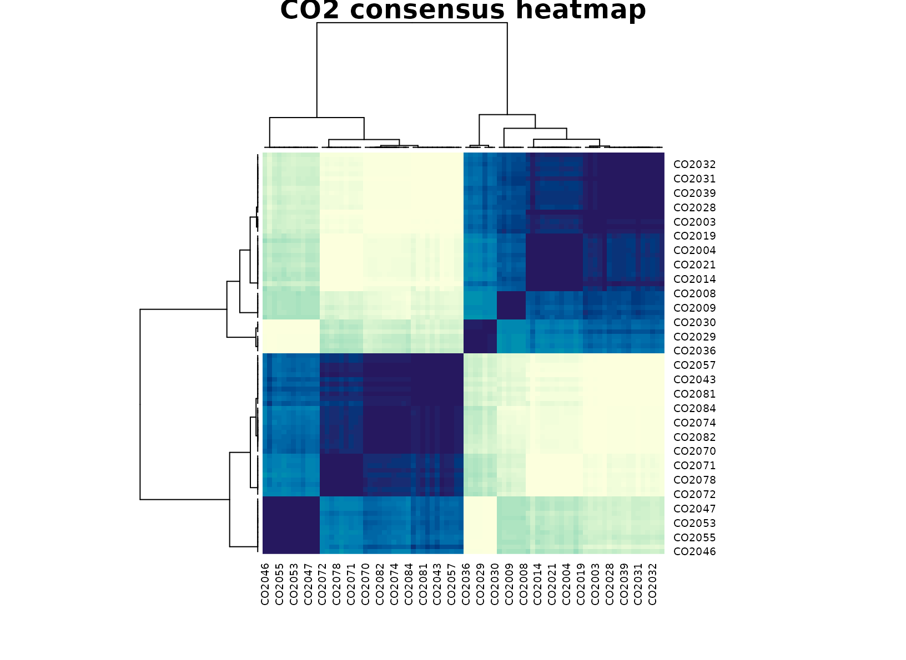

# CO2

## Background

`CO2` contains uptake measurements from grass plants under different
treatment and plant-type conditions. It is a compact biology dataset
where continuous response values and experimental annotations live in
the same table. The key biological feature is that uptake is observed
across concentration levels, so the dataset mixes physiological response
with experimental design factors rather than giving a single summary
number per plant.

## Objective

The goal is to ask whether `uccdf` recovers stable photosynthetic
response regimes from uptake values together with plant type, treatment,
and a coarse concentration band. In other words, we want to know whether
the dominant table structure looks like a biologically meaningful
response split rather than a mechanical recreation of the full
experimental design grid.

## Data preparation

``` r
co2_df <- CO2
co2_df$sample_id <- sprintf("CO2%03d", seq_len(nrow(co2_df)))
co2_df$conc_band <- ordered(
  cut(co2_df$conc, breaks = c(-Inf, 300, 700, Inf), labels = c("low", "mid", "high")),
  levels = c("low", "mid", "high")
)

analysis_co2 <- co2_df[, c("sample_id", "uptake", "Type", "Treatment", "conc_band")]
head(analysis_co2)
#>   sample_id uptake   Type  Treatment conc_band
#> 1    CO2001   16.0 Quebec nonchilled       low
#> 2    CO2002   30.4 Quebec nonchilled       low
#> 3    CO2003   34.8 Quebec nonchilled       low
#> 4    CO2004   37.2 Quebec nonchilled       mid
#> 5    CO2005   35.3 Quebec nonchilled       mid
#> 6    CO2006   39.2 Quebec nonchilled       mid
```

## Analysis

``` r
fit_co2 <- fit_uccdf(
  analysis_co2,
  id_column = "sample_id",
  candidate_k = 1:5,
  n_resamples = 20,
  n_null = 39,
  row_fraction = 0.85,
  col_fraction = 0.85,
  seed = 222
)

fit_co2$selection
#> $alpha
#> [1] 0.05
#> 
#> $global_p_value
#> [1] 0.025
#> 
#> $null_family
#> [1] "independence_marginal_null"
#> 
#> $detected_structure
#> [1] TRUE
#> 
#> $best_exploratory_k
#> [1] 2
#> 
#> $best_supported_k
#> [1] 2
select_k(fit_co2)
#>   k stability null_mean    null_sd stability_excess   z_score p_value supported
#> 1 2 0.5945211 0.4084903 0.05978767       0.18603075 3.1115231   0.025      TRUE
#> 2 3 0.6495645 0.5755818 0.04022979       0.07398272 1.8390029   0.075     FALSE
#> 3 4 0.9090439 0.8882409 0.04020363       0.02080293 0.5174389   0.325     FALSE
#> 4 5 0.9056215 0.8655018 0.02284305       0.04011972 1.7563201   0.075     FALSE
#>   objective
#> 1  2.972894
#> 2  1.619280
#> 3  0.240180
#> 4  1.434432
```

## Results

``` r
co2_assign <- merge(augment(fit_co2), co2_df, by.x = "row_id", by.y = "sample_id", all.x = TRUE)
head(co2_assign)
#>   row_id cluster confidence  ambiguity exploratory_cluster
#> 1 CO2001       1  0.8589348 0.14106521                   1
#> 2 CO2002       1  0.8592637 0.14073627                   1
#> 3 CO2003       1  0.9296333 0.07036665                   1
#> 4 CO2004       1  0.9070210 0.09297902                   1
#> 5 CO2005       1  0.8989071 0.10109295                   1
#> 6 CO2006       1  0.9028983 0.09710169                   1
#>   exploratory_confidence exploratory_ambiguity assignment_mode selected_k
#> 1              0.8589348            0.14106521        selected          2
#> 2              0.8592637            0.14073627        selected          2
#> 3              0.9296333            0.07036665        selected          2
#> 4              0.9070210            0.09297902        selected          2
#> 5              0.8989071            0.10109295        selected          2
#> 6              0.9028983            0.09710169        selected          2
#>   exploratory_k Plant   Type  Treatment conc uptake conc_band
#> 1             2   Qn1 Quebec nonchilled   95   16.0       low
#> 2             2   Qn1 Quebec nonchilled  175   30.4       low
#> 3             2   Qn1 Quebec nonchilled  250   34.8       low
#> 4             2   Qn1 Quebec nonchilled  350   37.2       mid
#> 5             2   Qn1 Quebec nonchilled  500   35.3       mid
#> 6             2   Qn1 Quebec nonchilled  675   39.2       mid
```

``` r
aggregate(
  cbind(uptake, conc, confidence) ~ cluster,
  co2_assign,
  function(x) round(mean(x, na.rm = TRUE), 2)
)
#>   cluster uptake conc confidence
#> 1       1  33.54  435       0.89
#> 2       2  20.88  435       0.90
```

``` r
table(co2_assign$cluster, co2_assign$Type)
#>    
#>     Quebec Mississippi
#>   1     42           0
#>   2      0          42
table(co2_assign$cluster, co2_assign$Treatment)
#>    
#>     nonchilled chilled
#>   1         21      21
#>   2         21      21
table(co2_assign$cluster, co2_assign$conc_band)
#>    
#>     low mid high
#>   1  18  18    6
#>   2  18  18    6
round(prop.table(table(co2_assign$cluster, co2_assign$Type), margin = 1), 3)
#>    
#>     Quebec Mississippi
#>   1      1           0
#>   2      0           1
```

``` r
plot_embedding(fit_co2, color_by = "selected", main = "CO2 latent embedding")
```



``` r
plot_consensus_heatmap(fit_co2, main = "CO2 consensus heatmap")
```



## Discussion

The selected two-cluster solution is biologically plausible because it
usually separates a higher-uptake regime from a lower-uptake regime
while only partly aligning with `Type` and `Treatment`. The
concentration-band table is especially helpful here: high-concentration
observations are enriched in the stronger uptake cluster, but they do
not define it completely. That means the consensus solution is
responding to a joint pattern in response magnitude and experimental
context, not just to one categorical field.

This is exactly where a typed consensus workflow earns its keep. A
purely numeric clustering on uptake and concentration could be dominated
by the concentration axis, while a factor-heavy approach could overstate
the design variables. The current result is a compromise: it identifies
broad response modes that remain stable across resampling.

## Interpretation

For `CO2`, the recovered groups are best interpreted as stable
photosynthetic response modes. A cautious reading is that one cluster
corresponds to stronger uptake under favorable response settings, while
the other collects weaker uptake measurements across the same
experimental space. The important point is not the exact label count; it
is that the table supports a reproducible two-regime summary that can
guide downstream biological visualization and exploratory comparison.
