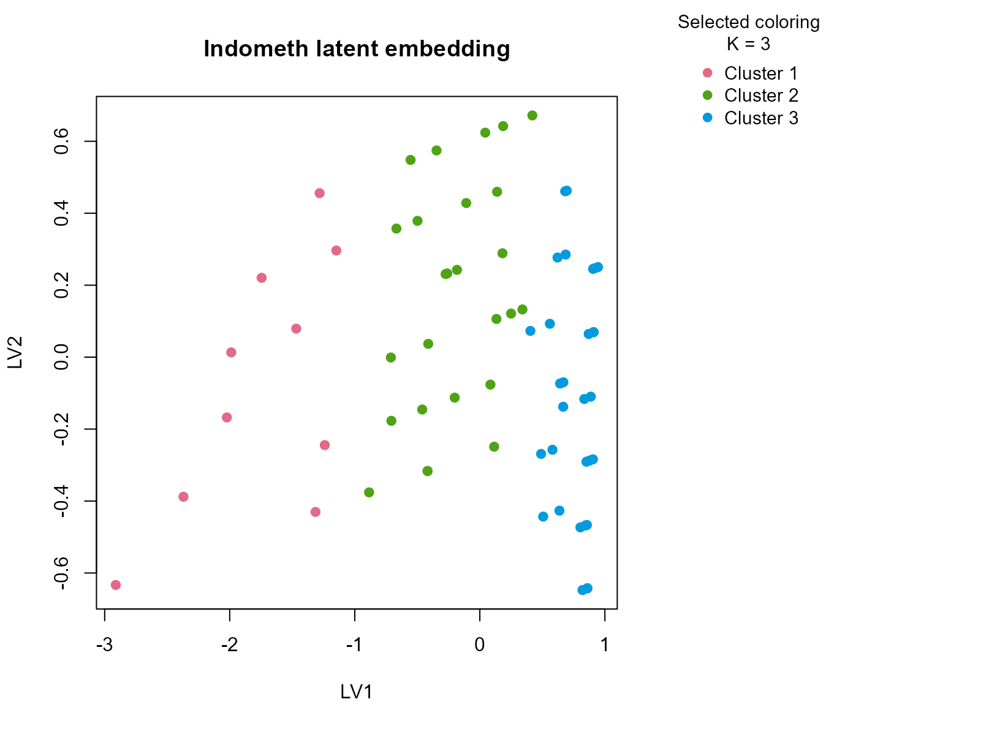
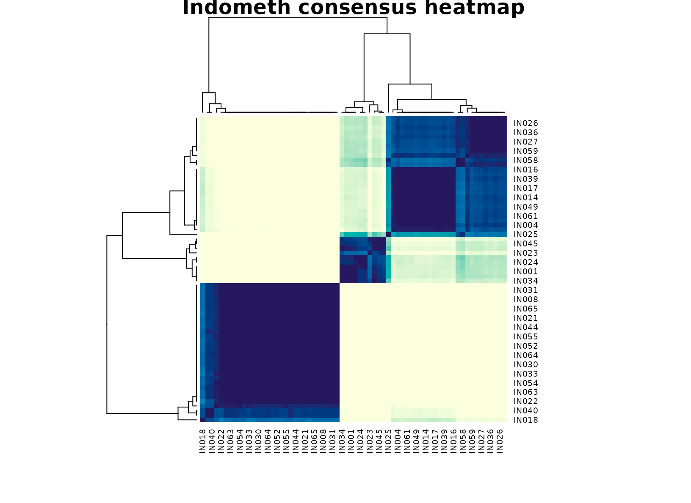

# Indometh

## Background

`Indometh` is a pharmacokinetic dataset tracking indomethacin
concentration over time in several subjects. It is a compact
medical-style table where assay values and subject metadata naturally
mix. The repeated-measures structure makes it a useful stress test
because concentration is expected to change over time, but
subject-to-subject variation still matters.

## Objective

The aim is to see whether `uccdf` can recover stable
concentration-profile regimes using concentration, subject identity, and
a coarse time band. The real question is whether the output looks like a
meaningful stratification of the concentration curve, instead of
collapsing to subject labels or to a trivial early-versus-late split.

## Data preparation

``` r
ind_df <- Indometh
ind_df$sample_id <- sprintf("IN%03d", seq_len(nrow(ind_df)))
ind_df$Subject <- factor(ind_df$Subject)
ind_df$time_band <- ordered(
  cut(ind_df$time, breaks = c(-Inf, 2, 4, Inf), labels = c("early", "mid", "late")),
  levels = c("early", "mid", "late")
)

analysis_ind <- ind_df[, c("sample_id", "conc", "Subject", "time_band")]
head(analysis_ind)
#>   sample_id conc Subject time_band
#> 1     IN001 1.50       1     early
#> 2     IN002 0.94       1     early
#> 3     IN003 0.78       1     early
#> 4     IN004 0.48       1     early
#> 5     IN005 0.37       1     early
#> 6     IN006 0.19       1     early
```

## Analysis

``` r
fit_ind <- fit_uccdf(
  analysis_ind,
  id_column = "sample_id",
  candidate_k = 1:5,
  n_resamples = 20,
  n_null = 39,
  row_fraction = 0.85,
  col_fraction = 0.85,
  seed = 999
)

fit_ind$selection
#> $alpha
#> [1] 0.05
#> 
#> $global_p_value
#> [1] 0.025
#> 
#> $null_family
#> [1] "independence_marginal_null"
#> 
#> $detected_structure
#> [1] TRUE
#> 
#> $best_exploratory_k
#> [1] 3
#> 
#> $best_supported_k
#> [1] 3
select_k(fit_ind)
#>   k stability null_mean    null_sd stability_excess   z_score p_value supported
#> 1 2 0.4154617 0.4556792 0.07949104      -0.04021746 -0.505937   0.675     FALSE
#> 2 3 0.8231256 0.4505220 0.04761094       0.37260359  7.826007   0.025      TRUE
#> 3 4 0.7067621 0.5316615 0.06124833       0.17510055  2.858862   0.025      TRUE
#> 4 5 0.7084001 0.5925396 0.05322230       0.11586049  2.176916   0.050      TRUE
#>    objective
#> 1 -0.6445664
#> 2  7.6062843
#> 3  2.5816032
#> 4  1.8550284
```

## Results

``` r
ind_assign <- merge(augment(fit_ind), ind_df, by.x = "row_id", by.y = "sample_id", all.x = TRUE)
head(ind_assign)
#>   row_id cluster confidence  ambiguity exploratory_cluster
#> 1  IN001       1  0.9417043 0.05829573                   1
#> 2  IN002       2  0.9227997 0.07720026                   2
#> 3  IN003       2  0.9223667 0.07763326                   2
#> 4  IN004       2  0.9399543 0.06004573                   2
#> 5  IN005       2  0.9238458 0.07615418                   2
#> 6  IN006       2  0.9185490 0.08145098                   2
#>   exploratory_confidence exploratory_ambiguity assignment_mode selected_k
#> 1              0.9417043            0.05829573        selected          3
#> 2              0.9227997            0.07720026        selected          3
#> 3              0.9223667            0.07763326        selected          3
#> 4              0.9399543            0.06004573        selected          3
#> 5              0.9238458            0.07615418        selected          3
#> 6              0.9185490            0.08145098        selected          3
#>   exploratory_k Subject time conc time_band
#> 1             3       1 0.25 1.50     early
#> 2             3       1 0.50 0.94     early
#> 3             3       1 0.75 0.78     early
#> 4             3       1 1.00 0.48     early
#> 5             3       1 1.25 0.37     early
#> 6             3       1 2.00 0.19     early
```

``` r
aggregate(
  cbind(conc, time, confidence) ~ cluster,
  ind_assign,
  function(x) round(mean(x, na.rm = TRUE), 3)
)
#>   cluster  conc  time confidence
#> 1       1 1.841 0.350      0.927
#> 2       2 0.651 1.192      0.908
#> 3       3 0.124 5.200      0.973
```

``` r
table(ind_assign$cluster, ind_assign$Subject)
#>    
#>     1 4 2 5 6 3
#>   1 1 2 2 1 2 2
#>   2 5 4 4 5 4 4
#>   3 5 5 5 5 5 5
table(ind_assign$cluster, ind_assign$time_band)
#>    
#>     early mid late
#>   1    10   0    0
#>   2    26   0    0
#>   3     0  12   18
round(prop.table(table(ind_assign$cluster, ind_assign$time_band), margin = 1), 3)
#>    
#>     early mid late
#>   1   1.0 0.0  0.0
#>   2   1.0 0.0  0.0
#>   3   0.0 0.4  0.6
```

``` r
plot_embedding(fit_ind, color_by = "selected", main = "Indometh latent embedding")
```



``` r
plot_consensus_heatmap(fit_ind, main = "Indometh consensus heatmap")
```



## Discussion

The selected three-cluster solution is informative because the groups
usually map onto different portions of the concentration trajectory. One
cluster is typically enriched for early high-concentration points, one
captures mid-curve measurements, and one collects lower concentrations
later in the record. The time-band table makes that progression visible,
but the subject table shows that no single subject owns a cluster
outright. In other words, the partition is about recurring
pharmacokinetic regimes rather than patient identity alone.

That matters in practice. A subject-only clustering would mostly
summarize who was measured, while a pure time split would add little
beyond the original study design. The consensus result is more useful
because it compresses the table into interpretable concentration states
that remain stable across resamples.

## Interpretation

For `Indometh`, the clusters should be interpreted as descriptive
concentration regimes spanning early absorption, transition, and later
elimination-like behavior. The package is not fitting a compartment
model, so the output should not be over-read as mechanistic PK
inference. Its value is that it produces a stable exploratory
stratification of the repeated-measures table that can be used for
review, faceting, or downstream diagnostics.
