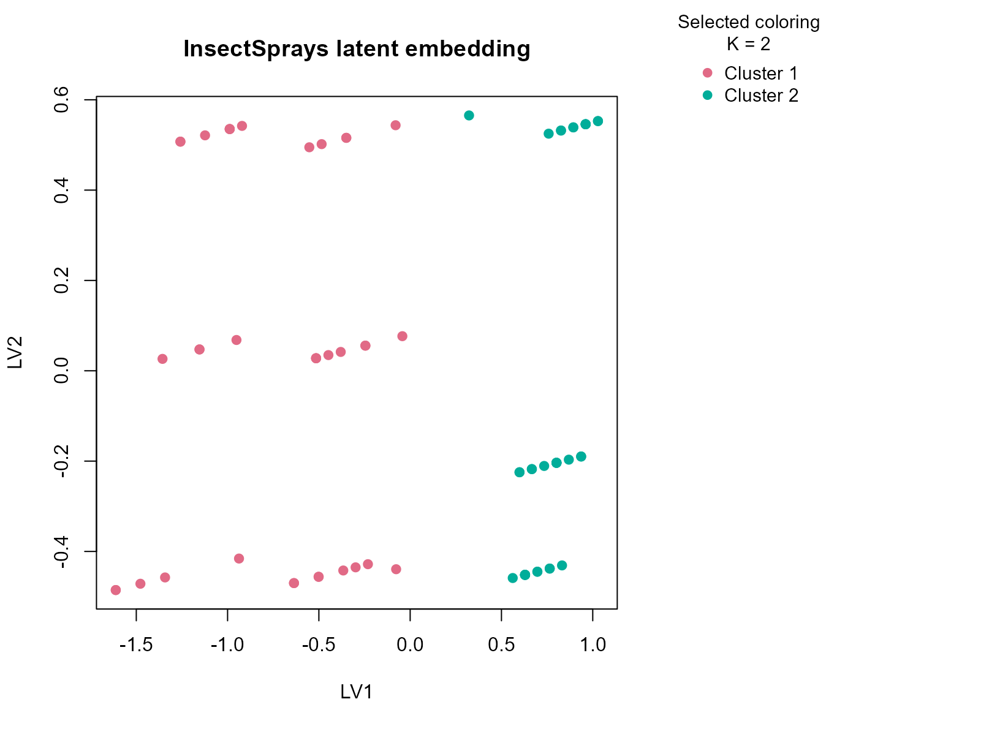

# InsectSprays

## Background

`InsectSprays` records insect counts under different spray conditions.
It is a small experimental dataset with a simple mixed structure: a
count-like numeric response plus a treatment factor. Despite its size,
it is a useful real-data example because the experimental factor is
known and the numeric outcome has clear practical meaning.

## Objective

The objective is to determine whether `uccdf` recovers stable efficacy
regimes from the observed insect counts and spray labels, and to check
whether the result reflects a broad low-count versus high-count
separation rather than an over-fragmented grouping of individual sprays.

## Data preparation

``` r
sprays_df <- InsectSprays
sprays_df$sample_id <- sprintf("IS%03d", seq_len(nrow(sprays_df)))
sprays_df$count_band <- ordered(
  cut(sprays_df$count, breaks = c(-Inf, 6, 15, Inf), labels = c("low", "mid", "high")),
  levels = c("low", "mid", "high")
)

analysis_sprays <- sprays_df[, c("sample_id", "count", "spray", "count_band")]
head(analysis_sprays)
#>   sample_id count spray count_band
#> 1     IS001    10     A        mid
#> 2     IS002     7     A        mid
#> 3     IS003    20     A       high
#> 4     IS004    14     A        mid
#> 5     IS005    14     A        mid
#> 6     IS006    12     A        mid
```

## Analysis

``` r
fit_sprays <- fit_uccdf(
  analysis_sprays,
  id_column = "sample_id",
  candidate_k = 1:5,
  n_resamples = 20,
  n_null = 39,
  row_fraction = 0.85,
  col_fraction = 0.85,
  seed = 333
)

fit_sprays$selection
#> $alpha
#> [1] 0.05
#> 
#> $global_p_value
#> [1] 0.025
#> 
#> $null_family
#> [1] "independence_marginal_null"
#> 
#> $detected_structure
#> [1] TRUE
#> 
#> $best_exploratory_k
#> [1] 2
#> 
#> $best_supported_k
#> [1] 2
select_k(fit_sprays)
#>   k stability null_mean    null_sd stability_excess  z_score p_value supported
#> 1 2 0.9499258 0.3861876 0.06245955        0.5637381 9.025651   0.025      TRUE
#> 2 3 0.6751667 0.3059309 0.07799298        0.3692358 4.734218   0.025      TRUE
#> 3 4 0.6607274 0.3969920 0.07093267        0.2637354 3.718109   0.025      TRUE
#> 4 5 0.7117390 0.5400487 0.05331053        0.1716903 3.220570   0.025      TRUE
#>   objective
#> 1  8.887021
#> 2  4.514495
#> 3  3.440850
#> 4  2.898682
```

## Results

``` r
sprays_assign <- merge(augment(fit_sprays), sprays_df, by.x = "row_id", by.y = "sample_id", all.x = TRUE)
head(sprays_assign)
#>   row_id cluster confidence   ambiguity exploratory_cluster
#> 1  IS001       1  0.9781701 0.021829861                   1
#> 2  IS002       1  0.9652655 0.034734506                   1
#> 3  IS003       1  0.9928565 0.007143456                   1
#> 4  IS004       1  0.9927567 0.007243336                   1
#> 5  IS005       1  0.9925926 0.007407408                   1
#> 6  IS006       1  0.9955785 0.004421466                   1
#>   exploratory_confidence exploratory_ambiguity assignment_mode selected_k
#> 1              0.9781701           0.021829861        selected          2
#> 2              0.9652655           0.034734506        selected          2
#> 3              0.9928565           0.007143456        selected          2
#> 4              0.9927567           0.007243336        selected          2
#> 5              0.9925926           0.007407408        selected          2
#> 6              0.9955785           0.004421466        selected          2
#>   exploratory_k count spray count_band
#> 1             2    10     A        mid
#> 2             2     7     A        mid
#> 3             2    20     A       high
#> 4             2    14     A        mid
#> 5             2    14     A        mid
#> 6             2    12     A        mid
```

``` r
aggregate(
  cbind(count, confidence) ~ cluster,
  sprays_assign,
  function(x) round(mean(x, na.rm = TRUE), 2)
)
#>   cluster count confidence
#> 1       1 15.41       0.99
#> 2       2  3.26       0.99
```

``` r
table(sprays_assign$cluster, sprays_assign$spray)
#>    
#>      A  B  C  D  E  F
#>   1 12 12  0  1  0 12
#>   2  0  0 12 11 12  0
table(sprays_assign$cluster, sprays_assign$count_band)
#>    
#>     low mid high
#>   1   0  21   16
#>   2  34   1    0
round(prop.table(table(sprays_assign$cluster, sprays_assign$spray), margin = 1), 3)
#>    
#>         A     B     C     D     E     F
#>   1 0.324 0.324 0.000 0.027 0.000 0.324
#>   2 0.000 0.000 0.343 0.314 0.343 0.000
```

``` r
plot_embedding(fit_sprays, color_by = "selected", main = "InsectSprays latent embedding")
```



``` r
plot_consensus_heatmap(fit_sprays, main = "InsectSprays consensus heatmap")
```


## Discussion

The selected two-cluster solution is easy to read against the
experimental context. One cluster is typically enriched for rows with
lower counts and the better-performing sprays, while the other collects
higher-count outcomes and the weaker treatment settings. The count-band
table is useful here because it makes clear that the split is anchored
in observed efficacy rather than in arbitrary factor coding.

This dataset is also a good calibration check for the method. Because
the table is small, a single clustering run can be unstable. The
consensus workflow still finds a coherent low-count versus high-count
separation, which is exactly the kind of conservative summary we want
from a stability-oriented tool.

## Interpretation

For `InsectSprays`, the resulting partition is best interpreted as a
stable contrast between more effective and less effective spray-response
regimes. The result is simple, but it is not trivial: it demonstrates
that `uccdf` can recover an interpretable consensus split even when the
dataset is small and the signal is partly encoded by a treatment factor.
