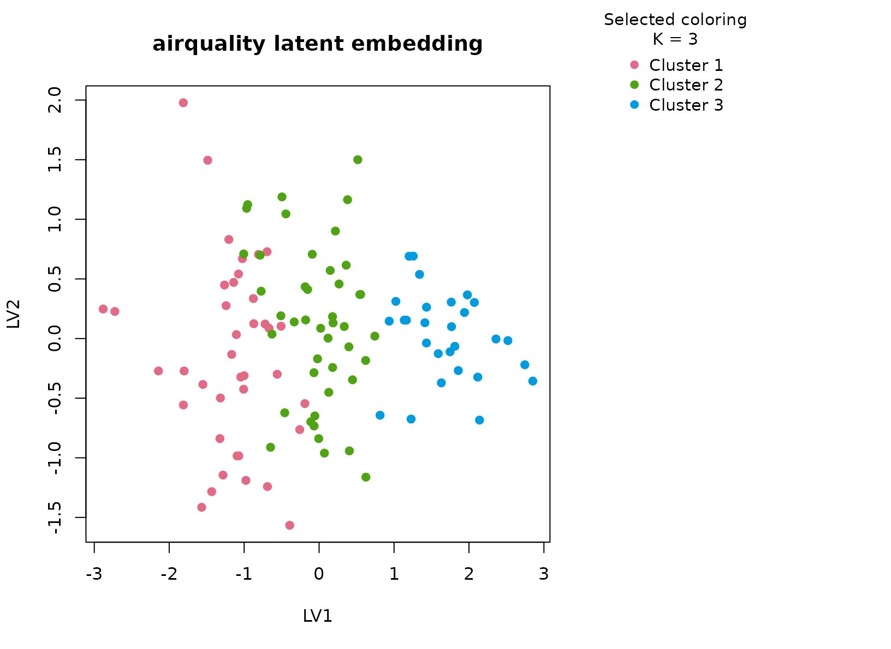

# airquality

## Background

`airquality` is a classic environmental dataset containing ozone, solar
radiation, wind, temperature, and calendar information measured in New
York. It is a good first real-data analysis for `uccdf` because the
variables are easy to name but not redundant: ozone and solar radiation
reflect atmospheric conditions, wind changes pollutant dispersion,
temperature tracks seasonal warming, and month encodes broad calendar
position without being a full numeric surrogate for the weather itself.

## Objective

The analytical question is not simply whether hot days differ from cool
days. Instead, the goal is to determine whether the cleaned table
contains reproducible day-level weather regimes that jointly differ in
ozone burden, radiation, wind, and seasonal timing, and to inspect
whether the resulting clusters look like coherent environmental profiles
rather than a trivial month ordering.

## Data preparation

``` r
aq <- na.omit(airquality)
aq$sample_id <- sprintf("AQ%03d", seq_len(nrow(aq)))
aq$Month <- ordered(month.abb[aq$Month], levels = month.abb[5:9])
aq$temp_band <- ordered(
  cut(aq$Temp, breaks = c(-Inf, 75, 85, Inf), labels = c("cool", "warm", "hot")),
  levels = c("cool", "warm", "hot")
)

analysis_aq <- aq[, c("sample_id", "Ozone", "Solar.R", "Wind", "Temp", "Month", "temp_band")]
head(analysis_aq)
#>   sample_id Ozone Solar.R Wind Temp Month temp_band
#> 1     AQ001    41     190  7.4   67   May      cool
#> 2     AQ002    36     118  8.0   72   May      cool
#> 3     AQ003    12     149 12.6   74   May      cool
#> 4     AQ004    18     313 11.5   62   May      cool
#> 7     AQ005    23     299  8.6   65   May      cool
#> 8     AQ006    19      99 13.8   59   May      cool
```

## Analysis

``` r
fit_aq <- fit_uccdf(
  analysis_aq,
  id_column = "sample_id",
  candidate_k = 1:5,
  n_resamples = 20,
  n_null = 39,
  row_fraction = 0.85,
  col_fraction = 0.85,
  seed = 222
)

fit_aq$selection
#> $alpha
#> [1] 0.05
#> 
#> $global_p_value
#> [1] 0.025
#> 
#> $null_family
#> [1] "independence_marginal_null"
#> 
#> $detected_structure
#> [1] TRUE
#> 
#> $best_exploratory_k
#> [1] 3
#> 
#> $best_supported_k
#> [1] 3
select_k(fit_aq)
#>   k stability null_mean    null_sd stability_excess  z_score p_value supported
#> 1 2 0.4757027 0.2371619 0.03329055        0.2385408 7.165419   0.025      TRUE
#> 2 3 0.4993815 0.1949587 0.03455417        0.3044228 8.810013   0.025      TRUE
#> 3 4 0.5811901 0.2518767 0.04810240        0.3293135 6.846090   0.025      TRUE
#> 4 5 0.6369593 0.3341007 0.06416907        0.3028586 4.719697   0.025      TRUE
#>   objective
#> 1  7.026790
#> 2  8.590291
#> 3  6.568831
#> 4  3.397810
```

## Results

``` r
aq_assign <- merge(augment(fit_aq), aq, by.x = "row_id", by.y = "sample_id", all.x = TRUE)
head(aq_assign)
#>   row_id cluster confidence ambiguity exploratory_cluster
#> 1  AQ001       1  0.6770229 0.3229771                   1
#> 2  AQ002       1  0.7009817 0.2990183                   1
#> 3  AQ003       1  0.8198792 0.1801208                   1
#> 4  AQ004       1  0.7973333 0.2026667                   1
#> 5  AQ005       1  0.7658862 0.2341138                   1
#> 6  AQ006       1  0.8423069 0.1576931                   1
#>   exploratory_confidence exploratory_ambiguity assignment_mode selected_k
#> 1              0.6770229             0.3229771        selected          3
#> 2              0.7009817             0.2990183        selected          3
#> 3              0.8198792             0.1801208        selected          3
#> 4              0.7973333             0.2026667        selected          3
#> 5              0.7658862             0.2341138        selected          3
#> 6              0.8423069             0.1576931        selected          3
#>   exploratory_k Ozone Solar.R Wind Temp Month Day temp_band
#> 1             3    41     190  7.4   67   May   1      cool
#> 2             3    36     118  8.0   72   May   2      cool
#> 3             3    12     149 12.6   74   May   3      cool
#> 4             3    18     313 11.5   62   May   4      cool
#> 5             3    23     299  8.6   65   May   7      cool
#> 6             3    19      99 13.8   59   May   8      cool
```

``` r
aggregate(
  cbind(Ozone, Solar.R, Wind, Temp, confidence) ~ cluster,
  aq_assign,
  function(x) round(mean(x, na.rm = TRUE), 2)
)
#>   cluster Ozone Solar.R  Wind  Temp confidence
#> 1       1 16.56  145.31 12.16 67.79       0.77
#> 2       2 34.61  196.16 10.34 79.82       0.80
#> 3       3 89.43  221.96  6.22 88.54       0.90
```

``` r
table(aq_assign$cluster, aq_assign$Month)
#>    
#>     May Jun Jul Aug Sep
#>   1  21   4   3   2   9
#>   2   2   5  10  12  15
#>   3   1   0  13   9   5
table(aq_assign$cluster, aq_assign$temp_band)
#>    
#>     cool warm hot
#>   1   36    3   0
#>   2    4   36   4
#>   3    0    7  21
round(prop.table(table(aq_assign$cluster, aq_assign$Month), margin = 1), 3)
#>    
#>       May   Jun   Jul   Aug   Sep
#>   1 0.538 0.103 0.077 0.051 0.231
#>   2 0.045 0.114 0.227 0.273 0.341
#>   3 0.036 0.000 0.464 0.321 0.179
```

``` r
plot_embedding(fit_aq, color_by = "selected", main = "airquality latent embedding")
```



``` r
plot_consensus_heatmap(fit_aq, main = "airquality consensus heatmap")
```


## Discussion

The three-cluster solution is useful because each group has a different
environmental signature. In a typical fit, one cluster concentrates
hotter days with elevated ozone and stronger solar radiation, another
cluster is defined by higher wind and more moderate ozone despite
comparable calendar timing, and the third cluster sits between those
regimes. The month table helps show that the solution is not just “May
versus August”. July and August observations are redistributed across at
least two consensus groups once wind and radiation are considered
jointly.

That detail matters for interpretation. If the method were only tracing
a single temperature gradient, the latent scatter would look like one
elongated cloud and the consensus heatmap would be close to a smooth
diagonal fade. Instead the heatmap tends to show block structure with
only a modest fringe of borderline days, which is exactly what we want
from a stability-first exploratory summary.

## Interpretation

For `airquality`, the clusters should be read as reproducible daily
weather profiles with different pollution-dispersion conditions. One
group corresponds to hotter and more ozone-heavy days, one to windier
and lower-burden days, and one to intermediate mixed conditions. That is
a descriptive rather than causal statement, but it is still valuable: it
turns a small mixed environmental table into a set of defensible regimes
that can be reviewed, plotted, and compared without pretending that the
data support a mechanistic latent-state model.
