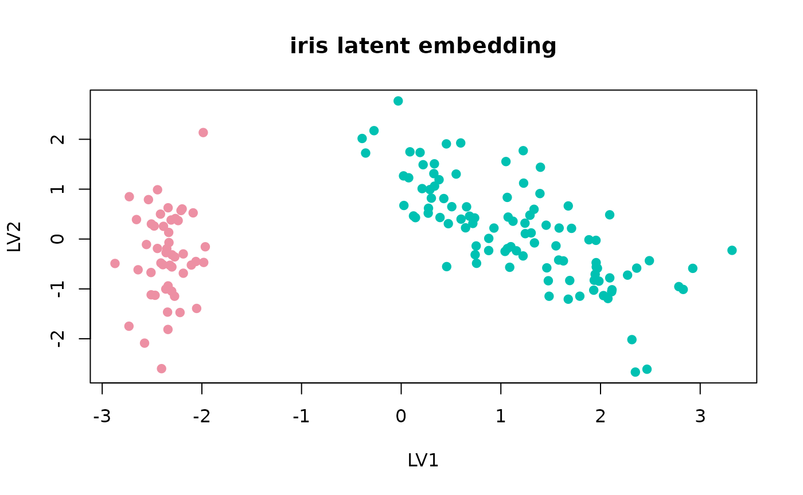

# Getting Started

## Overview

`uccdf` provides a compact consensus clustering workflow for tabular
data frames. The package keeps the API small and avoids bundled large
datasets.

## First run

``` r
fit <- fit_uccdf(iris, candidate_k = 2:4, n_resamples = 20, seed = 42)
fit
#> uccdf fit
#> - rows: 150
#> - active columns: 5
#> - selected_k: 2
select_k(fit)
#>   k stability
#> 1 2 0.9599499
#> 2 3 0.8362363
#> 3 4 0.7665610
head(augment(fit))
#>   row_id cluster confidence    ambiguity
#> 1      1       1          1 3.972623e-10
#> 2      2       1          1 4.269387e-10
#> 3      3       1          1 3.782320e-10
#> 4      4       1          1 5.252342e-10
#> 5      5       1          1 3.554589e-10
#> 6      6       1          1 4.596959e-10
```

``` r
plot_embedding(fit, main = "iris latent embedding")
```



``` r
plot_consensus_heatmap(fit, main = "iris consensus heatmap")
```


## Output

The main outputs are:

- the selected `K`
- the row-level assignments
- the consensus-derived confidence values
