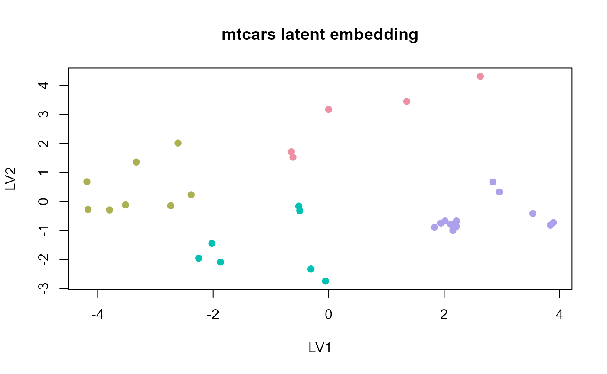

# mtcars

## Tutorial

``` r

fit <- fit_uccdf(mtcars, candidate_k = 2:4, n_resamples = 20, seed = 9)
select_k(fit)
#>   k stability
#> 1 2 0.6907096
#> 2 3 0.6551344
#> 3 4 0.7564624
head(augment(fit))
#>                              row_id cluster confidence  ambiguity
#> Mazda RX4                 Mazda RX4       1  0.6615156 0.33848443
#> Mazda RX4 Wag         Mazda RX4 Wag       1  0.7027244 0.29727564
#> Datsun 710               Datsun 710       2  0.9706535 0.02934655
#> Hornet 4 Drive       Hornet 4 Drive       3  0.8234848 0.17651515
#> Hornet Sportabout Hornet Sportabout       4  0.9553618 0.04463823
#> Valiant                     Valiant       3  0.7530109 0.24698912
```

``` r

plot_embedding(fit, main = "mtcars latent embedding")
```



``` r

plot_consensus_heatmap(fit, main = "mtcars consensus heatmap")
```


